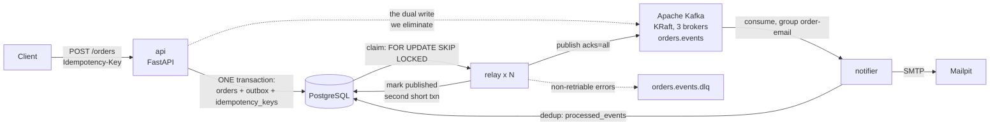

# Flash Order Notifier — Design

**Date:** 2026-08-19
**Status:** Approved for implementation planning
**Purpose:** A deliberately small order service built to practise the Transactional Outbox pattern in depth, including the Kafka broker-side mechanics that system design interviews probe.

---

## 1. The problem

When a customer places an order, two things must happen: the order is saved, and an `OrderCreated` event reaches a message broker. Doing both directly is a **dual write** — two writes to two systems with no shared transaction:

```python
db.commit()                    # succeeds
producer.produce(event)        # process dies here
```

The order exists and nobody is ever told. Reversing the order is no better: publish first and a rollback leaves an event describing an order that does not exist.

The Transactional Outbox pattern removes the second write from the request path. The API writes the event *into the same database, in the same transaction* as the order. A separate relay process moves rows from that table to Kafka afterwards. One durable write, one atomic commit, no lost events.

**This system is a learning artifact.** The order domain is scaffolding. The deliverable is the set of seven invariants in section 9 and the ability to defend every design decision out loud.

---

## 2. Non-goals

Explicitly out of scope. Each is a real concern that would obscure the lesson:

- Authentication, authorisation, rate limiting
- Inventory, payment, pricing, shipping
- Order status lifecycle beyond `CREATED`
- Multiple aggregates or event types beyond `OrderCreated`
- Schema Registry / Avro / Protobuf — the payload is JSON
- Kafka transactions and exactly-once semantics (see section 7.3 for why)
- Horizontal scaling of the API
- Production deployment, Kubernetes, observability backends

Deferred to a possible second spec: a Debezium CDC variant of the relay, for side-by-side comparison with the polling publisher built here.

---

## 3. Technology decisions

| Area | Decision | Rationale |
| --- | --- | --- |
| Language | Python 3.14 | Current stable (3.14.7, supported to 2030-10). |
| Web framework | FastAPI + SQLAlchemy 2.0 | `with session.begin():` makes the transaction boundary explicit while remaining realistic production code. |
| Database | PostgreSQL 18 | `SELECT … FOR UPDATE SKIP LOCKED` is the standard primitive for a safe multi-worker relay. |
| DB driver | `psycopg[binary]` 3 | See 3.5. |
| Broker | Apache Kafka 4.3, KRaft mode, **3 brokers** | See 3.1. |
| Kafka image | `apache/kafka` | See 3.2. |
| Kafka client | `confluent-kafka` (librdkafka) | See 3.3. |
| Relay style | Hand-written polling publisher, lease-based claim | See 3.4. |
| Migrations | Alembic | Standard for SQLAlchemy. |
| Packaging | `uv` | Single package, three console entrypoints. |
| Lint/format | `ruff` | Single tool for both. |
| Tests | `pytest` + `testcontainers[postgres,kafka]` | Real Postgres and Kafka; no broker mocks. |
| Logging | `structlog` | `event_id` as the correlation key across all three services. |
| Config | `pydantic-settings` | Environment-driven, typed. |

### 3.1 Three brokers, not one

A single broker exposes the entire *client* surface — partitions, keys, ordering, consumer groups, offsets, rebalances, lag, retention, compaction. What it cannot expose is replication: with `RF=1` there is no ISR to shrink, no leader election, and `acks=all` degrades to `acks=1`.

Three brokers with `RF=3` and `min.insync.replicas=2` make the project's most instructive drill real. Killing two brokers produces a genuine `NOT_ENOUGH_REPLICAS` rejection, at which point the outbox does the thing it exists for: events accumulate durably in Postgres while the API keeps returning `201`, then drain on recovery. A `docker pause` cannot demonstrate that.

Cost: roughly 1.5–2 GB of RAM and a slower `compose up`. Accepted.

### 3.2 `apache/kafka`, not `bitnami/kafka`

Bitnami has moved its free container catalog to a legacy repository and stopped updates; `bitnami/kafka:latest` now fails with access-denied errors for many users. A large share of the Kafka compose files published online are already broken for this reason. The official `apache/kafka` image in KRaft mode is the current path, and KRaft also removes the ZooKeeper container entirely — ZooKeeper was dropped from Kafka in 4.0.

### 3.3 `confluent-kafka`, not `kafka-python`

`kafka-python` is effectively unmaintained and lacks newer features. `confluent-kafka` wraps librdkafka, is actively maintained by Confluent, and has full idempotent-producer support.

It is a synchronous client, which costs nothing in this design: `api` is the only async service and it never touches Kafka. `relay` and `notifier` are plain worker processes. That the async question does not arise is itself a consequence of the outbox pattern.

### 3.4 Lease-based claim, not lock-held-through-publish

Three candidate relay designs were considered.

**Rejected — high-water-mark.** A single relay tracking `last_published_id` and reading forward needs no locking and preserves strict ordering, but it is **incorrect**. Postgres assigns sequence values *before* commit, so a slow transaction can commit id 100 after a fast one commits id 101. A relay that has advanced past 101 never sees 100. The row is lost permanently and silently. This is the classic trap and the reason `SKIP LOCKED` is the standard answer.

**Rejected for this project — lock held through publish.** A single transaction that selects with `FOR UPDATE SKIP LOCKED`, publishes, marks, and commits is simpler and correct. Its flaw is holding a row lock and a pooled connection across a network call: a wedged broker holds both for the full publish timeout. It also skips the three mechanics that make production outboxes interesting.

**Chosen — claim-then-publish (lease).** Two short transactions with the network call between them. Costs roughly sixty extra lines and a reclaimer for expired leases, and delivers lease expiry, attempt counting, and a natural home for DLQ routing. This matches the established guidance that lock-holding transactions should never span external I/O.

### 3.5 `psycopg` 3, not `asyncpg`

`psycopg3` ships a sync and an async implementation behind one driver. `api` is async and `relay`/`notifier` are sync worker processes, so a single dependency and a single connection-string format cover all three. `asyncpg` is async-only and would force a second driver — and a second set of type-adaptation quirks — into the sync services for no gain.

Install as `psycopg[binary]` so the C extension arrives prebuilt rather than compiling libpq bindings in every container image.

`greenlet` is a transitive requirement of SQLAlchemy's asyncio support. It is listed explicitly below only because its wheel availability was verified, not because it is imported directly.

### 3.6 Pinned versions

Verified against PyPI on 2026-08-19. Every C-extension dependency has a cp314 wheel, so no container build compiles from source.

| Package | Version | Notes |
| --- | --- | --- |
| `fastapi` | 0.141.1 | pure Python |
| `uvicorn` | 0.52.3 | the ASGI server FastAPI documents |
| `sqlalchemy` | 2.0.52 | pure Python |
| `psycopg[binary]` | 3.3.4 | cp314 wheels present |
| `greenlet` | 3.5.5 | cp314 wheels present; transitive via SQLAlchemy async |
| `alembic` | 1.19.1 | |
| `confluent-kafka` | 2.15.0 | cp314 wheels present |
| `pydantic` | 2.13.4 | |
| `pydantic-settings` | 2.15.0 | |
| `structlog` | 26.1.0 | |
| `pytest` | 9.1.1 | |
| `testcontainers` | 4.15.0 | |
| `httpx` | 0.28.1 | required by FastAPI's `TestClient` |
| `ruff` | 0.16.3 | Rust binary, `py3-none-manylinux` |
| `uv` | 0.12.5 | Rust binary, `py3-none-manylinux` |

Images: `python:3.14-slim`, `postgres:18`, `apache/kafka:4.3.1`, `axllent/mailpit`, `kafbat/kafka-ui`.

No `pytest-asyncio`. FastAPI's documented test approach is the **synchronous** `TestClient`, and test fixtures can use a sync SQLAlchemy engine even though the app uses the async one. Adding an async test framework for tests that need not be async is a dependency bought for nothing. If a genuinely async test appears later, add it then.

---

## 4. Architecture

Three services written here, three off-the-shelf containers, one Postgres.



The dashed line from `api` to Kafka is the bug this system exists to remove. **`api` has no Kafka client and no Kafka configuration.** Its durability story is a single commit.

### 4.1 Components

| Component | Responsibility | Depends on |
| --- | --- | --- |
| `api` | Accept the order. Write three rows in one transaction. Return 201. | `shared`, Postgres |
| `relay` | Claim outbox rows under a lease, publish, mark. Reclaim expired leases. Route poison messages to the DLQ. | `shared`, Postgres, Kafka |
| `notifier` | Consume `orders.events`, deduplicate on `event_id`, send mail, commit offsets. | `shared`, Postgres, Kafka, SMTP |
| `shared` | SQLAlchemy models, session factory, event contract, settings, logging. | — |
| `postgres` | Single source of truth. Every guarantee here is a Postgres transaction. | — |
| `kafka` (×3) | KRaft mode, combined broker + controller. | — |
| `kafka-ui` | Partitions, offsets, and live consumer-group lag on `:8080`. | Kafka |
| `mailpit` | Fake SMTP with a web inbox on `:8025`. Duplicate delivery becomes visible, not grepped. | — |

Dependency arrows point only *into* `shared`. `api` does not import `relay`; `relay` does not import `notifier`. If one service cannot start without importing another, the boundary is wrong.

---

## 5. Data model

Four tables. Every guarantee is a constraint, not application code being careful.

### 5.1 `orders`

| Column | Type | Notes |
| --- | --- | --- |
| `id` | `uuid` | PK |
| `customer_email` | `text` | NOT NULL |
| `item_sku` | `text` | NOT NULL |
| `quantity` | `int` | NOT NULL, CHECK > 0 |
| `status` | `text` | NOT NULL, always `'CREATED'` in this scope |
| `created_at` | `timestamptz` | NOT NULL DEFAULT `now()` |

### 5.2 `outbox`

Two halves, and the divide matters. Above the line is the event — immutable once written, and a contract with the outside world. Below is relay bookkeeping, private to the relay.

| Column | Type | Notes |
| --- | --- | --- |
| `id` | `uuid` | PK. **This is the `event_id`** carried end to end. |
| `aggregate_type` | `text` | NOT NULL, `'order'` |
| `aggregate_id` | `text` | NOT NULL, the order id. **Becomes the Kafka partition key.** |
| `event_type` | `text` | NOT NULL, `'OrderCreated'` |
| `payload` | `jsonb` | NOT NULL |
| `created_at` | `timestamptz` | NOT NULL DEFAULT `now()` |
| — | — | — relay state below — |
| `status` | `outbox_status` enum | `pending` \| `publishing` \| `published` \| `dead` |
| `attempts` | `int` | NOT NULL DEFAULT 0 |
| `next_attempt_at` | `timestamptz` | NOT NULL DEFAULT `now()`. Backoff lives here. |
| `locked_by` | `text` | NULL. Relay instance id holding the lease. |
| `locked_until` | `timestamptz` | NULL. Lease expiry. |
| `last_error` | `text` | NULL |
| `published_at` | `timestamptz` | NULL |

Naming follows Debezium's **vocabulary** (`aggregate_type`, `aggregate_id`, `event_type`, `payload`) in snake_case **spelling**. Debezium's SMT allows configuring every column name, so exact-name alignment would save a few lines of connector config rather than a migration — not enough to justify `aggregatetype` in SQLAlchemy models, or a column named `type` shadowing a Python builtin.

**Indexes:**

```sql
CREATE INDEX ix_outbox_pending ON outbox (next_attempt_at)
  WHERE status = 'pending';

CREATE INDEX ix_outbox_reclaim ON outbox (locked_until)
  WHERE status = 'publishing';
```

Both are partial, and that is load-bearing rather than polish. Without the `WHERE`, the claim index grows alongside millions of published rows and the relay slows as the table ages — a gradual, confusing failure worth designing away from the start.

### 5.3 `idempotency_keys`

| Column | Type | Notes |
| --- | --- | --- |
| `key` | `text` | PK. From the `Idempotency-Key` header. |
| `request_hash` | `text` | NOT NULL. SHA-256 of the canonicalised request body. |
| `order_id` | `uuid` | FK → `orders.id` |
| `response_code` | `int` | NOT NULL |
| `response_body` | `jsonb` | NOT NULL |
| `created_at` | `timestamptz` | NOT NULL DEFAULT `now()` |

Storing the full response is what lets a replay return the *identical* `201`, rather than a fresh one. Same key with a different body is a client bug and returns `409` (Stripe's behaviour).

### 5.4 `processed_events`

| Column | Type | Notes |
| --- | --- | --- |
| `handler` | `text` | PK part 1, e.g. `'order-email'` |
| `event_id` | `uuid` | PK part 2. Equals `outbox.id`. |
| `processed_at` | `timestamptz` | NOT NULL DEFAULT `now()` |

The composite key lets a second consumer deduplicate independently rather than consuming the first one's record.

### 5.5 The thread

One UUID crosses every boundary: generated inside the API transaction as `outbox.id`, carried as a Kafka message header `event_id`, checked against `processed_events.event_id` by the consumer. That single column is the entire reason duplicate delivery is harmless.

---

## 6. Data flow

### 6.1 Write path (`api`)

```
POST /orders → BEGIN → INSERT idempotency_keys → INSERT orders → INSERT outbox → COMMIT → 201
```

All three inserts are one atomic unit. There is no window in which an order exists without its event. No Kafka call, no HTTP call, no queue push.

`Idempotency-Key` is required; a request without it returns `400`. On a key collision with a matching `request_hash`, the stored response is replayed. On a collision with a differing hash, `409`.

**Crash before `COMMIT`:** everything rolls back. The client retries with the same key and gets a clean `201`. Consistent.

**Crash after `COMMIT`, before the response:** order and event both exist and the relay publishes regardless. The client retries and receives the same stored `201`. Consistent.

### 6.2 Relay path

```
TXN 1 (claim)        SELECT … FOR UPDATE SKIP LOCKED
                     status='publishing', locked_by, locked_until, attempts+1, COMMIT
   ↓ no transaction held
produce → Kafka      acks=all, await delivery report
   ↓ no transaction held
TXN 2 (mark)         status='published', published_at, COMMIT
```

The lock is released before the network call. That is the entire reason for two transactions: a wedged broker never holds a Postgres row or a pooled connection hostage.

| Crash point | Result |
| --- | --- |
| After claim, before produce | Row stuck at `publishing`; `locked_until` passes; reclaimer resets it to `pending`. Republished, **no loss**. |
| **After Kafka acks, before the mark commits** | Kafka has the event, Postgres says `publishing`. Lease expires, row reclaimed, event published **twice**. |
| Produce rejected | Row returns to `pending` with backoff, or is dead-lettered — see section 7. |

**The middle case — ack before mark — cannot be eliminated.** Two systems, no shared transaction. Every outbox implementation has this window; the honest ones say so and build the consumer to absorb it. This is precisely why `processed_events` exists and why the guarantee is **at-least-once**, not exactly-once.

**The reclaimer** runs inside every relay instance rather than as a separate process, on `RECLAIM_INTERVAL`. Its query uses `FOR UPDATE SKIP LOCKED` for the same reason the claim does — with N relays scanning concurrently, two of them must never reclaim the same abandoned row. It resets `status` to `pending`, clears `locked_by` and `locked_until`, and sets `next_attempt_at = now()`.

`locked_by` is the relay instance id: the container hostname plus a per-process UUID, so restarts of the same container are distinguishable. It exists for diagnosis and for invariant I3 — nothing about correctness depends on its value, only on the lease.

### 6.3 Consumer path (`notifier`)

```
poll (auto-commit OFF)
  → BEGIN
  → INSERT processed_events ON CONFLICT DO NOTHING RETURNING event_id
  → nothing returned? skip the send (duplicate)
  → otherwise SMTP → Mailpit
  → COMMIT
  → commit offset
```

| Crash point | Result |
| --- | --- |
| After `COMMIT`, before the offset commit | Kafka redelivers; the insert returns nothing; the send is skipped. **No duplicate email.** This is the common case. |
| After SMTP, before `COMMIT` | The mail is gone — email cannot be rolled back. The dedup row rolls back, so redelivery sends again. |

The guarantee is therefore **effectively-once**, not exactly-once. Deduplication shrinks the duplicate window from "every redelivery" to "a crash inside a few milliseconds". Closing it entirely requires an idempotent downstream — a provider-side idempotency key on the send — which is out of scope but is the honest answer to "why not exactly-once?".

**A deliberate asymmetry:** the relay *splits* its transaction to avoid holding locks across the network; the notifier *keeps* the send inside one, because there the dedup record and the side effect should share fate. Same tradeoff, opposite resolution, because the goals differ.

---

## 7. Error and retry policy

### 7.1 Relay timings

| Setting | Value | Rationale |
| --- | --- | --- |
| `BATCH_SIZE` | 100 | Loop immediately when a full batch is returned. |
| `POLL_INTERVAL` | 500 ms | Idle only. Reducible later with `LISTEN/NOTIFY`. |
| `LEASE_SECONDS` | 60 | Must exceed worst-case publish plus the mark transaction. |
| `delivery.timeout.ms` | 30 s | **Invariant: must be < `LEASE_SECONDS`.** |
| `RECLAIM_INTERVAL` | 5 s | Scans `status='publishing' AND locked_until < now()`. |
| Backoff | 1 s, ×2, cap 60 s, jittered | Jitter prevents N relays retrying in lockstep. |

`delivery.timeout.ms < LEASE_SECONDS` is a hard constraint. Violating it manufactures duplicates on every slow publish, because another relay reclaims the row while the first is still working on it. Tests override both to small values.

### 7.2 Error classification

The common advice — "retry N times, then dead-letter" — is actively harmful here. During a broker outage every retriable failure would exhaust its attempts and dead-letter the entire backlog, destroying the exact property the outbox provides. So failures split by class:

**Retriable** — `NOT_ENOUGH_REPLICAS`, transport failure, request timeout, leader-not-available. Retry **indefinitely** with capped, jittered backoff. Never dead-lettered. The backlog is the feature. The alert signal is `outbox_oldest_pending_seconds`, not an attempt count.

**Non-retriable** — message too large, serialisation failure, invalid record. Set `status='dead'`, copy to `orders.events.dlq`, record `last_error`, move on **immediately**. Retrying a poison message a thousand times teaches nothing and blocks the batch.

`attempts` increments in both cases; it is the evidence during drills.

### 7.3 Why not Kafka transactions

Kafka's transactional producer gives exactly-once *between Kafka topics*. It cannot span Postgres and Kafka, so it does not close the ack-before-mark window in 6.2 — the only window that matters here. `enable.idempotence=true` is set, and it is worth knowing precisely what it buys: deduplication of the producer's own internal retries within a session. It does not help when the relay process dies.

---

## 8. Configuration

### 8.1 Topics

| Topic | Partitions | RF | `min.insync.replicas` | Retention |
| --- | --- | --- | --- | --- |
| `orders.events` | 3 | 3 | 2 | 7 days |
| `orders.events.dlq` | 1 | 3 | 2 | 30 days |

Three partitions match the broker count and allow 2–3 notifier instances, making rebalances observable. Message key is `aggregate_id`, so all events for one order land on one partition and per-order ordering holds.

### 8.2 Producer (`relay`)

`acks=all`, `enable.idempotence=true`, `compression.type=lz4`, `linger.ms=5`, `delivery.timeout.ms=30000`.

### 8.3 Consumer (`notifier`)

`group.id=order-email`, `enable.auto.commit=false`, `auto.offset.reset=earliest`. Offsets are committed only after the database transaction commits.

---

## 9. Testing strategy

The services are what make the invariants pass. The invariants are the deliverable.

### 9.1 Failure-injection seams

A `SIGKILL` cannot reliably land between a Kafka ack and a Postgres commit — that window is microseconds wide. The relay loop therefore exposes named hooks:

```python
hooks.after_claim()
hooks.after_publish_before_mark()   # crash window in 6.2
hooks.after_mark()
```

No-ops in production, monkeypatched to raise in tests. This turns "crash at exactly the worst moment" into a deterministic assertion, and is the difference between a suite that proves the invariants and one that hopes.

### 9.2 The seven invariants

Each gets a test module under `tests/invariants/`, written before its implementation.

| # | Invariant | How it is forced |
| --- | --- | --- |
| I1 | **No loss** — every committed order eventually reaches the topic | Raise at each hook in turn; assert the event still arrives |
| I2 | **No orphan events** — no event whose order is not committed | Roll back the API transaction; assert the topic stays empty |
| I3 | **No double-claim** — two relays never hold one row at once | Run two relays against a large batch; assert disjoint claims |
| I4 | **Duplicates tolerated** — forced duplicate yields one email | Raise at `after_publish_before_mark`; assert exactly one send |
| I5 | **Per-order ordering** — same `order_id` arrives in produce order | Emit a sequence for one order; assert partition and offset order |
| I6 | **Backlog and drain** — broker down, API still returns 201 | Stop the broker; post orders; restart; assert full drain |
| I7 | **Edge idempotency** — N identical posts create one order | Post concurrently with one key; assert one order, one event |

### 9.3 Known limitation

The test suite runs a **single** Kafka broker via testcontainers — fast, and sufficient for six of the seven invariants. I6 stops the broker container outright rather than shrinking the ISR. The genuine `min.insync.replicas` version exists only as a manual drill against the three-broker compose stack (section 9.4). This gap is stated rather than papered over.

### 9.4 Chaos drills

`make` targets against `docker compose`, for the demonstrations you watch rather than assert:

| Target | What it shows |
| --- | --- |
| `chaos-kill-relay` | Lease expiry and reclaim; the event still arrives |
| `chaos-kill-broker` | One broker → leader election and ISR shrink; writes continue |
| `chaos-kill-two-brokers` | `NOT_ENOUGH_REPLICAS`; outbox absorbs the backlog; drains on recovery |
| `chaos-pause-notifier` | Consumer-group lag climbing live in kafka-ui |
| `chaos-duplicate` | A forced republish; Mailpit still shows one email |
| `load` | Fire N concurrent orders |

---

## 10. Repository layout

```
outboxexpress/
├── docker-compose.yml          # postgres, kafka1-3, kafka-ui, mailpit, api, relay, notifier
├── pyproject.toml
├── Makefile                    # dev loop + chaos targets
├── alembic.ini
├── migrations/versions/
├── src/outboxexpress/
│   ├── shared/
│   │   ├── config.py           # pydantic-settings
│   │   ├── db.py               # engine, session factory
│   │   ├── models.py           # the four tables
│   │   ├── events.py           # OrderCreatedV1 — the wire contract
│   │   └── logging.py          # structlog, event_id correlation
│   ├── api/
│   │   ├── main.py
│   │   ├── routes.py           # POST /orders, GET /orders/{id}, GET /healthz
│   │   ├── schemas.py
│   │   ├── service.py          # the one transaction
│   │   └── idempotency.py
│   ├── relay/
│   │   ├── __main__.py         # entrypoint, signal handling
│   │   ├── claim.py            # SKIP LOCKED claim + lease reclaim
│   │   ├── publisher.py        # producer + error classification
│   │   ├── hooks.py            # failure-injection seams
│   │   └── loop.py
│   └── notifier/
│       ├── __main__.py
│       ├── consumer.py
│       ├── dedup.py
│       └── mailer.py
└── tests/
    ├── conftest.py             # testcontainers: postgres + kafka
    ├── unit/
    └── invariants/
```

`shared/events.py` holds `OrderCreatedV1` as a Pydantic model — the single definition imported by both the relay and the notifier, so the wire contract cannot drift.

---

## 11. API contract

### `POST /orders`

Headers: `Idempotency-Key: <string>` (required; `400` if absent).

```json
{ "customer_email": "a@b.com", "item_sku": "SKU-1", "quantity": 2 }
```

`201`:

```json
{ "order_id": "…uuid…", "status": "CREATED", "created_at": "…" }
```

Responses: `201` created · `201` again on an idempotent replay, byte-identical to the stored body · `400` validation error or missing key · `409` key reused with a different body · `503` database unavailable.

A replay returns the **stored** `response_code` and `response_body` verbatim, not a freshly built response. That is the point of storing them: a retrying client cannot tell a replay from the original, and never learns that its first attempt succeeded after it gave up waiting.

### `GET /orders/{id}` → `200` / `404`
### `GET /healthz` → `200` when Postgres is reachable. It does **not** check Kafka: the API is healthy without a broker, which is the pattern working as intended.

### Event payload (`OrderCreatedV1`)

Kafka key: `aggregate_id`. Headers: `event_id`, `event_type`, `aggregate_type`, `occurred_at`.

```json
{
  "event_id": "…uuid…",
  "event_type": "OrderCreated",
  "version": 1,
  "occurred_at": "2026-08-19T07:00:00Z",
  "order": {
    "id": "…uuid…",
    "customer_email": "a@b.com",
    "item_sku": "SKU-1",
    "quantity": 2,
    "created_at": "2026-08-19T07:00:00Z"
  }
}
```

---

## 12. Deferred decisions

Recorded so they are not silently re-litigated during implementation:

- **`LISTEN/NOTIFY` nudge.** Would cut relay tail latency from ~500 ms to milliseconds. Polling remains the correctness backstop; the notification is only a hint. Deferred: it is an optimisation, and the 500 ms latency is visible and instructive as-is.
- **Retention of `published` rows.** Left as "keep forever" for now. The partial indexes mean table growth does not slow the relay. A periodic purge is a later addition once there is something to measure.
- **Debezium CDC variant.** A second spec, built after this one works, for side-by-side comparison.
- **Provider-side send idempotency.** The only way to close the consumer duplicate window in 6.3. Out of scope; named so the limitation is understood rather than forgotten.

---

## 13. Implementation sequencing

This design is too large for one implementation plan. It splits into three milestones, each independently runnable, demonstrable, and worth its own plan. Each ends with something you can watch work.

**M1 — Foundation and the write path.** `shared` (config, db, models, events, logging), Alembic migrations for all four tables, `api` with the single-transaction service and idempotency handling, `docker compose` with Postgres only. Proves **I2** and **I7**. At the end, orders and outbox rows commit together and a replayed `Idempotency-Key` returns the identical response — with no Kafka anywhere in the project yet, which makes the point that the API's guarantee does not depend on a broker.

**M2 — Relay and Kafka.** The three-broker KRaft cluster, kafka-ui, topics, `relay` with claim, lease, reclaim, publish, mark, error classification, and DLQ routing. The failure-injection hooks land here. Proves **I1**, **I3**, **I4** and **I5**. At the end, events reach the topic and survive the relay being killed at every point in its cycle.

**M3 — Consumer and chaos.** `notifier` with dedup and SMTP, Mailpit, the `make chaos-*` targets. Proves **I6**, and closes **I4** end to end by showing one email despite a duplicated event. At the end, the whole failure catalogue is demonstrable by hand.

Each milestone gets its own plan, written when the previous one is complete rather than all three up front — later plans benefit from what the earlier implementation teaches.

---

## 14. References

- [Debezium Outbox Event Router](https://debezium.io/documentation/reference/stable/transformations/outbox-event-router.html) — column vocabulary
- [SQLAlchemy 2.0 `with_for_update`](https://docs.sqlalchemy.org/en/20/core/selectable.html) — `skip_locked=True` renders `FOR UPDATE SKIP LOCKED` on PostgreSQL
- [confluent-kafka-python](https://github.com/confluentinc/confluent-kafka-python) — the maintained client
- [apache/kafka Docker image](https://hub.docker.com/r/apache/kafka) — KRaft mode
- [Bitnami image deprecation](https://northflank.com/blog/bitnami-deprecates-free-images-migration-steps-and-alternatives) — why not `bitnami/kafka`
- [Outbox, not dual writes](https://aniljaiswal.com/blog/transactional-outbox-pattern-postgres-kafka)
- [A durable outbox and job queue in plain Postgres](https://dev.to/poojang/you-probably-dont-need-kafka-a-durable-outbox-and-job-queue-in-plain-postgres-4791) — short-transaction claim guidance
