# The Transactional Outbox Pattern — A Complete Reference

**What this is.** A single, self-contained reference for the transactional outbox
pattern as it is described in the literature and as it is actually run in
production. It covers both ends: the service that produces events and the
service that consumes them.

**How to read it.** Part I explains why the pattern exists — read it once, in
order. Parts II–V are reference material: schema, relay, consumer, operations.
Navigate them by the table of contents.

**Conventions.** SQL is standard where possible, with PostgreSQL syntax where a
dialect is unavoidable (noted each time). Logic is pseudocode, not any real
language. `-->` in diagrams is a message; `-x` is a failure.

---

## Table of Contents

**Part I — Why the pattern exists**
1. [The dual-write problem](#1-the-dual-write-problem)
2. [Why not two-phase commit](#2-why-not-two-phase-commit)
3. [The pattern in one page](#3-the-pattern-in-one-page)

**Part II — The producing end**

4. [The outbox table](#4-the-outbox-table)
5. [Writing the event in the same transaction](#5-writing-the-event-in-the-same-transaction)
6. [The message contract](#6-the-message-contract)

**Part III — The relay**

7. [The polling publisher](#7-the-polling-publisher)
8. [Running more than one relay](#8-running-more-than-one-relay)
9. [Ordering](#9-ordering)
10. [Poison entries and the producer-side dead letter](#10-poison-entries-and-the-producer-side-dead-letter)
11. [Transaction log tailing (CDC)](#11-transaction-log-tailing-cdc)

**Part IV — The consuming end**

12. [Idempotent consumers](#12-idempotent-consumers)
13. [The inbox pattern](#13-the-inbox-pattern)
14. [Acknowledgement and delivery semantics](#14-acknowledgement-and-delivery-semantics)
15. [Retries, dead letters and replay](#15-retries-dead-letters-and-replay)
16. [Exactly-once, honestly](#16-exactly-once-honestly)

**Part V — Reality**

17. [Broker comparison](#17-broker-comparison)
18. [Operating the pattern](#18-operating-the-pattern)
19. [Failure-mode catalogue](#19-failure-mode-catalogue)
20. [Edge cases and how to handle them](#20-edge-cases-and-how-to-handle-them)
21. [Testing](#21-testing)
22. [Anti-patterns](#22-anti-patterns)
23. [When not to use it](#23-when-not-to-use-it)
24. [Implementation checklists](#24-implementation-checklists)
25. [Glossary and further reading](#25-glossary-and-further-reading)

---

# Part I — Why the pattern exists

## 1. The dual-write problem

A service handles `POST /orders`. It must do two things:

1. Persist the order to its database.
2. Tell the rest of the system an order was placed, so that shipping reserves
   stock and notifications emails the customer.

The database and the message broker are two independent systems. There is no
transaction that spans them. So the handler must write to one, then the other —
a **dual write** — and a dual write has no atomic form.

### Order A — commit, then publish

```
BEGIN
  INSERT INTO orders ...
COMMIT                      -- (1)
publish("order.placed")     -- (2)
```

Between (1) and (2) the process can die: an OOM kill, a pod eviction, a machine
losing power, a deploy rolling the container. The order exists; the event never
happened. Nothing is inconsistent *inside* the database, which is exactly why
this is dangerous — no error is raised, no alert fires, and the order simply
never ships. This is a **lost event**, and it is silent.

```mermaid
sequenceDiagram
    autonumber
    participant C as Client
    participant S as Order Service
    participant DB as Database
    participant B as Broker

    C->>S: POST /orders
    S->>DB: BEGIN; INSERT order; COMMIT
    DB-->>S: committed
    Note over S: process dies here
    S--xB: publish("order.placed") never happens
    S-->>C: (no response, client retries)
    Note over DB,B: Order exists. No event.<br/>Shipping never learns. Silent.
```

If publishing merely *fails* rather than the process dying, a retry loop helps —
until the loop itself is interrupted. `try/catch` cannot catch a `SIGKILL`. Any
in-process retry only shrinks the window; it never closes it.

### Order B — publish, then commit

```
publish("order.placed")     -- (1)
BEGIN
  INSERT INTO orders ...
COMMIT                      -- (2)
```

Now the crash — or a constraint violation, a deadlock, a serialisation failure —
happens between (1) and (2). The event was published; the order was never
persisted. Downstream services reserve stock and email a customer about an order
that does not exist. This is a **phantom event**, and it is worse than the lost
one, because it propagates.

### Order C — publish inside the transaction

```
BEGIN
  INSERT INTO orders ...
  publish("order.placed")   -- inside the transaction
COMMIT
```

This looks safer and is not. The broker is not enrolled in the database
transaction; `publish` takes effect the moment the broker acks it, and a
subsequent `ROLLBACK` cannot recall it. This is Order B with the failure window
disguised. It also holds a database transaction open across a network call to a
third party — locks held, connections pinned, transaction duration at the mercy
of the broker's latency.

### Why the usual escapes do not work

| Proposed fix | Why it fails |
|---|---|
| Retry the publish in a loop | The process can die inside the loop. Shrinks the window; never closes it. |
| Make the endpoint idempotent and let the client retry | The write already succeeded, so the retry short-circuits and returns `200`. It never republishes the missing event. |
| Wrap it in `try/finally` | `finally` does not run on `SIGKILL`, OOM, or power loss. |
| Reconcile with a nightly job | A real fallback, but it is a second implementation of delivery, running hours late, and it needs to distinguish "never published" from "published and ignored". At that point you have built a worse outbox. |
| Publish from an after-commit hook | Identical to Order A. The hook runs after the commit, outside any transaction, and the process can die before it runs. |

The failure windows here are milliseconds wide. That reads as negligible until
you work out what it means: if the gap between commit and publish is 1 ms and the
service handles 100 orders/second, the process is *inside* that window about 10%
of the time. Roughly one in ten crashes, evictions or restarts therefore loses an
event — and pods are evicted, nodes are drained and deploys roll every day.

**The root cause:** two independent systems, no shared atomic commit. Fix the
root cause and everything above evaporates.

## 2. Why not two-phase commit

Two-phase commit (2PC), standardised as XA, is the textbook way to make two
resources commit atomically. A transaction coordinator asks every participant to
*prepare*; each participant durably promises it can commit and gives up its right
to refuse; once all have promised, the coordinator tells them all to *commit*.

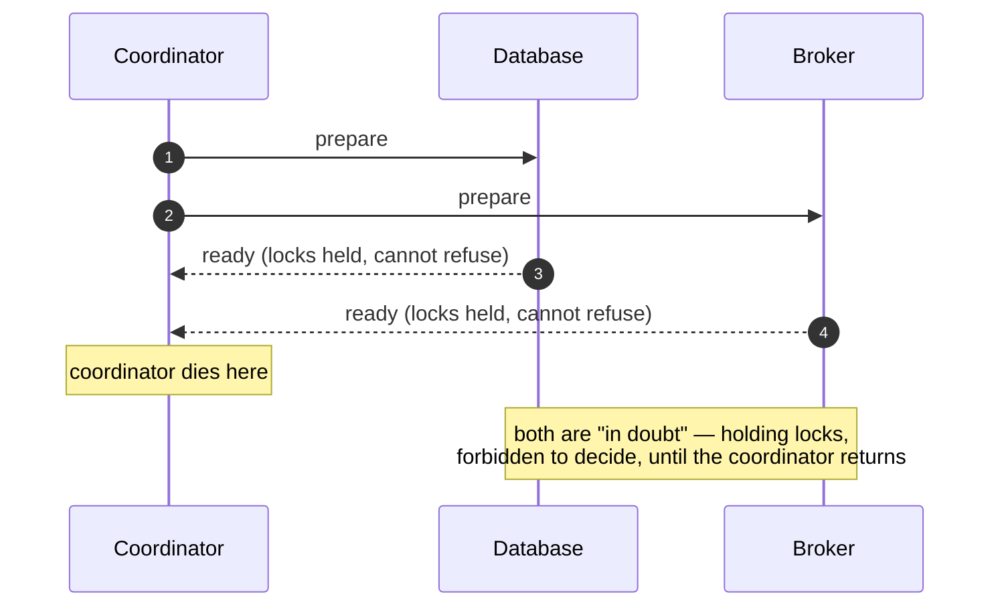

It is correct, and it is nearly extinct in modern service architectures for
reasons worth understanding:

- **The coordinator is a single point of failure with teeth.** If it dies after
  the prepare phase, participants are *in doubt*: they have promised to commit,
  so they may not abort, and nobody has told them to commit. They hold their
  locks until the coordinator recovers. A coordinator outage becomes a database
  outage.
- **Availability multiplies downward.** The transaction succeeds only if every
  participant is up. Two systems at 99.9% give you 99.8%. The pattern gets worse
  as you add participants — the opposite of what a distributed architecture is
  supposed to buy.
- **Latency.** Multiple round trips plus a durable `fsync` per participant per
  phase, on the request path.
- **Support has evaporated.** Kafka does not implement XA. RabbitMQ's
  transaction support is limited and slow, and its distributed transaction story
  is not XA. Kafka's "transactions" are a different mechanism entirely — atomic
  read-process-write *within Kafka*, which does not extend to your database.
- **It fits the wrong model.** Services own their data and are deployed
  independently; XA couples their commit paths and their uptimes.

Pat Helland's *Life Beyond Distributed Transactions* (2007) is the canonical
argument: at scale, you give up distributed transactions and design around
*at-least-once messaging plus idempotent operations*. That is precisely what the
outbox pattern implements.

**The move:** stop trying to make two systems commit atomically. Make the event
part of the one transaction you already have, and propagate it asynchronously.

## 3. The pattern in one page

**The idea.** The database can commit two rows atomically. So instead of
publishing the event, *write the event to a table in the same database, in the
same transaction as the business data*. A separate process then reads that table
and publishes to the broker.

**The invariant.** The business state and the intent to publish commit together
or not at all. There is no interleaving in which one exists without the other,
because they are one commit in one system.

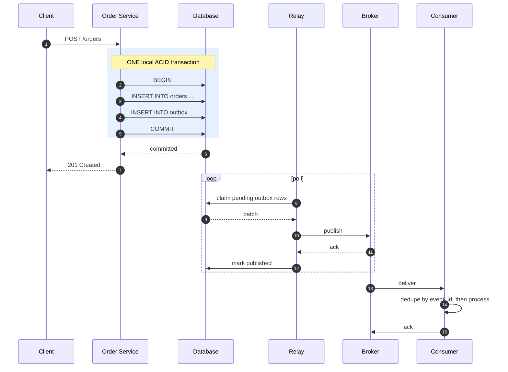

**Components.**

| Component | Responsibility |
|---|---|
| **Application** | Writes business state and the outbox row in one transaction. |
| **Outbox table** | Durable, transactional buffer of messages awaiting publication. |
| **Message relay** (publisher) | Reads unpublished rows, publishes them, marks them done. A dumb pipe. |
| **Broker** | Transports and retains messages. |
| **Consumer** | Processes each message idempotently. |
| **Inbox table** | Consumer-side record of processed message ids, for deduplication. |

**What the pattern guarantees.**

- Every committed state change produces its event **eventually** — nothing is
  lost, even across crashes, restarts and broker outages.
- No **phantom events**: an event is never published for a transaction that
  rolled back.
- **At-least-once** delivery.
- **Per-aggregate ordering**, if you take the care described in [§9](#9-ordering).

**What it does not guarantee — and this is the part people get wrong.**

- **Not exactly-once.** Duplicates are inherent, not a bug to be fixed. See
  [§16](#16-exactly-once-honestly).
- **Not synchronous.** The event lands after the commit, plus relay latency —
  typically tens to hundreds of milliseconds when polling, single-digit
  milliseconds with CDC. Consumers are eventually consistent with the producer.
- **Not global ordering.** Only per-key.
- **It does not remove the need for idempotent consumers.** The producing end is
  half the pattern. A correct outbox with a non-idempotent consumer is still a
  broken system.

**The one-sentence version:** trade an impossible atomic write across two systems
for a possible atomic write within one, and pay for it with duplicates that the
consumer is designed to absorb.

---

# Part II — The producing end

## 4. The outbox table

### The schema

```sql
CREATE TABLE outbox (
    -- identity and ordering
    id              BIGSERIAL     PRIMARY KEY,
    event_id        UUID          NOT NULL UNIQUE,

    -- routing
    aggregate_type  TEXT          NOT NULL,
    aggregate_id    TEXT          NOT NULL,
    event_type      TEXT          NOT NULL,
    schema_version  INTEGER       NOT NULL DEFAULT 1,

    -- content
    payload         JSONB         NOT NULL,
    headers         JSONB         NOT NULL DEFAULT '{}',
    occurred_at     TIMESTAMPTZ   NOT NULL DEFAULT now(),

    -- relay bookkeeping
    status          TEXT          NOT NULL DEFAULT 'pending',
    attempts        INTEGER       NOT NULL DEFAULT 0,
    available_at    TIMESTAMPTZ   NOT NULL DEFAULT now(),
    last_error      TEXT,
    published_at    TIMESTAMPTZ,

    CONSTRAINT outbox_status_check
        CHECK (status IN ('pending', 'published', 'failed'))
);

-- The only index the relay's hot path needs. Partial, so it stays small
-- even when the table holds millions of published rows.
CREATE INDEX outbox_pending_idx
    ON outbox (available_at, id)
    WHERE status = 'pending';
```

### Column by column

**`id BIGSERIAL`** — a monotonically assigned sequence. This is the ordering
authority and the relay's sort key. Use it, never a timestamp:

> **Never order the relay by `occurred_at` or any wall-clock column.** Clocks
> skew between application instances, NTP steps backwards, and two rows written
> in the same millisecond have no defined order. The sequence is monotonic and
> local to the database. Order by `id`.

Note that sequence *gaps* are normal — a rolled-back transaction consumes
sequence values that never appear as rows. A gap is not evidence of a lost event.

**`event_id UUID UNIQUE`** — the message's stable identity, generated once by
the producer and carried in the published message. It is the consumer's
deduplication key.

> **Generate it once, at insert time, and never regenerate it.** If the relay
> mints a new id on each publish attempt, a retried publish looks like a brand
> new event and consumer deduplication silently stops working. This is the single
> most common way to break the pattern while appearing to implement it correctly.

UUIDv7 (or ULID) is preferable to UUIDv4: it is time-ordered, so it indexes
without random-insert page splits and sorts usefully in logs.

**`aggregate_type` / `aggregate_id`** — which entity this event is about
(`'order'` / `'9f3c…'`). `aggregate_type` selects the destination topic;
`aggregate_id` becomes the broker partition key, which is what buys per-entity
ordering ([§9](#9-ordering)). Both are needed by the relay, so keep them as
columns rather than digging them out of the payload — the relay must never parse
business content.

**`event_type` + `schema_version`** — `'order.placed'`, version `1`. Consumers
dispatch on the type and decode according to the version. Both belong in the
message headers too, so a consumer can route without deserialising the payload.

**`payload JSONB`** — the message body, *already serialised into its final
published form*. The relay must be a dumb pipe: whatever it reads is what it
sends. If the relay has to enrich, look things up, or re-render, then the message
was not fully determined at commit time, and you have reintroduced a dependency
between publishing and application state.

Use `JSONB` when you want to query and read the table during incidents — worth a
great deal operationally. Use `BYTEA` when publishing Avro or Protobuf against a
schema registry; store the exact bytes including any magic-byte/schema-id prefix.

**`headers JSONB`** — transport metadata that is not business data:
`correlation_id`, `causation_id`, `tenant_id`, and `traceparent` (W3C Trace
Context). Propagating `traceparent` is what keeps a distributed trace connected
across the asynchronous hop; without it, your trace ends at the commit and a
disconnected one begins at the consumer.

**`occurred_at`** — when the business fact happened. Distinct from
`published_at` (when it left) and from the consumer's receipt time. Consumers
care about `occurred_at`; the gap between them is your end-to-end latency.

**`status`, `attempts`, `available_at`, `last_error`, `published_at`** — relay
bookkeeping, described in [§7](#7-the-polling-publisher). `available_at` is the
earliest time the relay may attempt this row; it implements retry backoff without
a separate delay queue.

### The visibility gap — why status beats a cursor

A tempting simplification is to drop `status` and have the relay remember the
last `id` it published:

```sql
-- DO NOT DO THIS
SELECT * FROM outbox WHERE id > :last_seen ORDER BY id LIMIT 500;
```

This loses events. Sequence values are assigned at `INSERT`, but rows become
visible at `COMMIT`, and those orders differ:

```
T1: INSERT (gets id=100) ....................... COMMIT   <- commits second
T2:      INSERT (gets id=101) ... COMMIT                  <- commits first
```

The relay polls between T2's commit and T1's, sees `id=101`, publishes it, and
advances its cursor to 101. When `id=100` commits a moment later it is already
behind the cursor. **It is never published, and nothing detects this.**

Claiming by status has no such flaw: uncommitted rows are simply invisible to the
relay's snapshot, and once they commit they appear as pending and are picked up
on a later pass. Order is preserved for everything the relay can see, and nothing
is skipped permanently. Every correct polling relay claims by state, not by
position.

### Keep or delete published rows?

| Strategy | Pros | Cons |
|---|---|---|
| **Mark `published`, purge later** *(recommended default)* | Auditable — you can answer "was this event ever sent, and when?" during an incident. Enables manual republish. | Table grows; needs a purge job; dead tuples and index bloat. |
| **`DELETE` on publish** | Table stays tiny and fully cached; no purge job; the relay's query is trivially fast. | No audit trail, no republish, no forensic answer to "did we send it?". |
| **`INSERT` then `DELETE` in the same transaction** | Zero table growth; the row exists only in the write-ahead log. | Only works with CDC ([§11](#11-transaction-log-tailing-cdc)) — there is nothing for a polling relay to read. |

Start with mark-and-purge; the operational visibility is worth the storage. Move
to delete-on-publish or daily partitioning when volume demands it
([§18](#18-operating-the-pattern)).

### The row's life

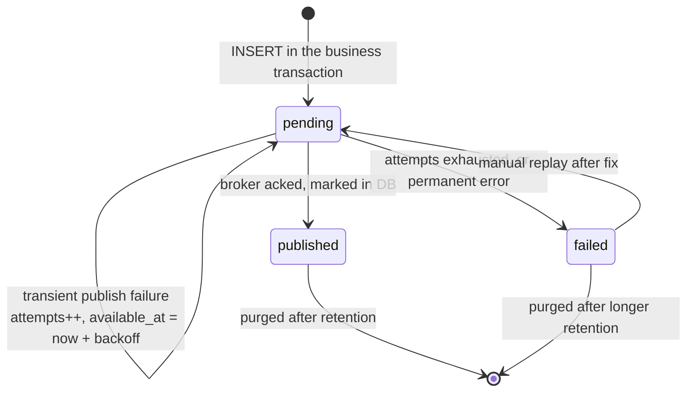

### Scope and placement

- **One outbox table per service database.** The outbox is a private
  implementation detail of the service that owns the data. Two services sharing
  one outbox table is two services sharing a database — the coupling the
  architecture exists to avoid.
- **One outbox per database, not per aggregate type.** A single table keeps the
  relay simple and preserves a single global sequence. Route by
  `aggregate_type` at publish time.
- **Sharded databases** get one outbox table and one relay (or relay shard) per
  shard. There is no cross-shard ordering, and asking for it means asking for a
  distributed transaction again.

## 5. Writing the event in the same transaction

Everything in Part II collapses if this one thing is wrong.

### The rules

1. **Same transaction.** The outbox insert and the business write must be in the
   same database transaction, on the same connection. Not a second session, not a
   separate connection pool checkout, not autocommit, not a different database.
2. **Nothing external inside the transaction.** No HTTP calls, no broker
   publishes, no emails, no S3 uploads. Transactions hold locks; holding them
   across a network call to a system you do not control converts that system's
   latency into your database's lock contention.
3. **No after-commit hook as the delivery path.** An ORM's "after commit" or
   "after flush" listener that publishes to the broker is Order A from
   [§1](#1-the-dual-write-problem) with better syntax. It may exist as an
   *optimisation* that nudges the relay awake — never as the mechanism that
   delivers.
4. **Keep the transaction short.** The outbox is a hot table; long transactions
   there delay vacuum and, in PostgreSQL, hold back the `xmin` horizon for the
   whole database.

### The shape

```
function place_order(command):
    begin transaction

        order = Order.place(command)          # pure domain logic, no I/O
        orders.insert(order)

        for event in order.pending_events():
            outbox.insert(
                event_id       = uuid7(),
                aggregate_type = 'order',
                aggregate_id   = order.id,
                event_type     = event.type,
                schema_version = event.version,
                payload        = serialise(event),
                headers        = {
                    correlation_id: context.correlation_id,
                    causation_id:   command.id,
                    traceparent:    context.traceparent,
                },
                occurred_at    = event.occurred_at,
            )

    commit                                     # <- the atomic moment

    notify_relay()                             # best effort; see §7
    return order.id
```

`notify_relay()` is deliberately outside the transaction and deliberately
allowed to fail. It only shortens latency. If it never runs, the poll loop finds
the row anyway.

### Collecting events from the domain

The common arrangement, and the one that keeps domain logic clean:

- Aggregates record events on themselves as they change state
  (`order.pending_events()`), knowing nothing about tables or brokers.
- The unit of work drains those events during commit and writes them to the
  outbox.
- The outbox insert lives in the persistence layer. The domain never imports it.

This matters because it is the only way "every state change emits its event"
becomes structural rather than a rule people must remember at each call site.

### Multiple events, and events for other side effects

Several events in one transaction are fine: they commit together, and their `id`
values preserve their relative order. If the transaction rolls back, none of them
exist.

If a business operation must also do something non-transactional — send an email,
call a payment API — that is not a special case. Write an event; let a consumer
do it. The consumer then has its own idempotency problem to solve
([§13](#13-the-inbox-pattern)), which is a solved problem, unlike the dual write.

### The failure modes this closes

| Moment of failure | Outcome |
|---|---|
| Crash before commit | Nothing happened. No order, no event. Client retries. |
| Crash during commit | The database resolves it atomically. Both rows, or neither. |
| Crash after commit, before the relay runs | Order and event row both exist. The relay publishes it on its next pass — possibly minutes later after a restart, but it publishes. |
| Broker unavailable for an hour | Rows accumulate in the outbox. Nothing is lost. Requests keep succeeding. |

That last row is the pattern's quiet superpower: **a broker outage stops being an
outage of your write path.** The database absorbs it as a backlog.

## 6. The message contract

The outbox row is durable and will be read by services you do not deploy. Its
payload is a public interface, and it needs to be designed like one.

### How much state to carry

| Style | Payload | Consequence |
|---|---|---|
| **Notification** | `{"order_id": "9f3c"}` — "something changed, go look" | Small messages, but every consumer must call back to the producer. That is coupling, load, and a dependency on the producer's availability. Worse, the callback returns *current* state, which may be newer than the event — a consumer processing an old event can act on newer data and produce results that never existed as a consistent state. |
| **Event-carried state transfer** *(recommended)* | The fields consumers need, as of the moment the event occurred | Consumers are autonomous; they work while the producer is down; no callback load; the data is consistent with the event. Costs larger messages and a real versioning obligation. |

Carry the fields consumers need plus identifiers for the rest, and include the
aggregate's version so consumers can detect staleness. Do not carry the whole
entity reflexively: every field you publish is a field you must keep publishing.

### The envelope

Separate transport metadata from business data. Rather than inventing an
envelope, use **CloudEvents 1.0** — it is a CNCF specification with bindings for
Kafka, AMQP, HTTP and others, and it means your metadata is already understood by
tooling.

```json
{
  "specversion": "1.0",
  "id": "018f4c2a-6b1e-7c3d-9a44-2f8e1d5b7c90",
  "type": "com.acme.order.placed",
  "source": "/services/orders",
  "subject": "9f3c1e6a-4b2d-4f8a-9c11-77a2e0d3b5f1",
  "time": "2026-08-24T10:15:30.123Z",
  "dataschema": "https://schemas.acme.com/order/placed/1.json",
  "datacontenttype": "application/json",
  "traceparent": "00-4bf92f3577b34da6a3ce929d0e0e4736-00f067aa0ba902b7-01",
  "data": {
    "order_id": "9f3c1e6a-4b2d-4f8a-9c11-77a2e0d3b5f1",
    "customer_id": "c-88213",
    "version": 1,
    "currency": "EUR",
    "total_cents": 4599,
    "lines": [
      { "sku": "SKU-1", "qty": 2, "unit_cents": 1799 },
      { "sku": "SKU-9", "qty": 1, "unit_cents": 1001 }
    ]
  }
}
```

`id` is the `event_id` — the same value the consumer deduplicates on. `subject`
is the aggregate id. Business fields live under `data` and nowhere else.

### Evolution

Consumers are deployed independently and some of them will be older than your
producer forever. The rules that follow from that:

- **Additive changes only within a version.** Add optional fields with sensible
  absent-value semantics.
- **Never repurpose a field, change its type, or tighten its meaning.** Renaming
  `total` to `total_cents` is a breaking change even if the number is identical.
- **Never remove a field consumers may read.** Deprecate, wait, verify nobody
  reads it, then remove in a new major version.
- **Tolerant reader.** Consumers must ignore fields they do not recognise. This
  is a rule for the code you write as a consumer, and it is what makes additive
  producer changes safe.
- **Breaking change → new `schema_version`, or a new `event_type`.** Publish both
  old and new during the migration window, then retire the old once consumers
  have moved. The outbox makes dual-publishing easy: write two rows in the same
  transaction.
- **With Avro or Protobuf, use a schema registry** with `BACKWARD` compatibility
  enforced (new schemas can read old data), or `FULL` if consumers may also be
  ahead of producers.

### Size

Brokers cap message size — Kafka defaults to 1 MB, and raising it degrades
throughput and memory behavior across the cluster. Keep messages small.

For genuinely large content, use the **claim check** pattern: store the blob in
object storage inside the same operation, and put a reference plus a checksum in
the event. Never store file content in the outbox table; you will turn a hot,
frequently-vacuumed table into a slow one and blow out the broker at the same
time.

### Personal data

Outbox rows are copies of business data and inherit its obligations. They live
in your database until purged, in the broker until its retention expires, and in
every consumer's inbox and projections. If a payload contains personal data,
decide deliberately: minimise fields, shorten outbox retention, consider
encrypting the payload with a per-subject key so that destroying the key
satisfies erasure across all those copies at once.

---

# Part III — The relay

The relay — Chris Richardson calls it the *message relay*, and the polling
variant the *polling publisher* — is the process that moves rows from the outbox
to the broker. It is the only component the pattern adds, and it should be the
dumbest code in the system: read rows, send bytes, mark rows. Any business logic
here means the payload was not finished at commit time.

Deploy it as its own process. Embedding it in the API service works and is
common at small scale, but it couples publishing throughput to request-handling
capacity, and it means a scale-down of the API is a scale-down of delivery.

## 7. The polling publisher

### The loop

```
loop forever:
    begin transaction

        batch = SELECT * FROM outbox
                 WHERE status = 'pending'
                   AND available_at <= now()
                 ORDER BY id
                 LIMIT :batch_size
                 FOR UPDATE SKIP LOCKED

        if batch is empty:
            commit
            wait(idle_backoff or notification)     # see "Latency" below
            continue

        for row in batch:                          # strictly in id order
            try:
                ack = broker.publish(
                    topic     = topic_for(row.aggregate_type),
                    key       = row.aggregate_id,          # partition key
                    value     = row.payload,
                    headers   = row.headers + {
                        event_id:       row.event_id,
                        event_type:     row.event_type,
                        schema_version: row.schema_version,
                    },
                )
                await ack                                  # MUST wait
                UPDATE outbox
                   SET status = 'published', published_at = now()
                 WHERE id = row.id

            except TransientError as e:                    # broker down, timeout
                UPDATE outbox
                   SET attempts     = attempts + 1,
                       available_at = now() + backoff(attempts),
                       last_error   = str(e)
                 WHERE id = row.id
                break                                      # stop the batch

            except PermanentError as e:                    # too large, unroutable
                UPDATE outbox
                   SET status = 'failed', last_error = str(e)
                 WHERE id = row.id
                alert(row)

    commit
```

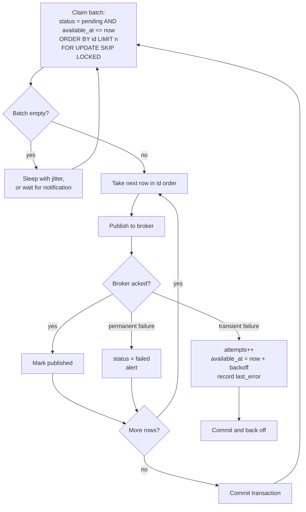

### `FOR UPDATE SKIP LOCKED` — the load-bearing clause

This is what makes a relay safe to run more than once and what makes it
efficient. It gives you:

- **Mutual exclusion per row.** A row claimed by one relay is locked; a second
  relay cannot claim it, so the same row is never published concurrently by two
  processes.
- **No blocking.** `SKIP LOCKED` means the second relay *skips* locked rows
  instead of waiting for them. Without it, relays serialise behind each other and
  concurrency buys nothing.
- **Automatic lease release.** If a relay crashes or its connection drops, the
  database rolls back its transaction and releases the locks immediately. There
  is no stuck-claim problem and no reaper job to write — a genuine advantage over
  the `locked_by`/`locked_at` column approach.

Available in PostgreSQL 9.5+, MySQL 8.0+, Oracle, and SQL Server (via
`READPAST`). If your database lacks it, claim with an atomic update instead:

```sql
UPDATE outbox
   SET status = 'claimed', claimed_by = :relay_id, claimed_at = now()
 WHERE id IN (
    SELECT id FROM outbox
     WHERE status = 'pending' AND available_at <= now()
     ORDER BY id LIMIT :batch_size
 )
RETURNING *;
```

…and then you *do* need a reaper: `UPDATE outbox SET status='pending' WHERE
status='claimed' AND claimed_at < now() - lease_interval`. Note that the lease
timeout must exceed your worst-case publish time, or the reaper will hand a row
to a second relay while the first is still publishing it — a duplicate factory.

This variant also needs `'claimed'` added to the schema's `outbox_status_check`
constraint, plus the `claimed_by` and `claimed_at` columns. The schema in
[§4](#the-schema) is written for the `SKIP LOCKED` design, which needs neither.

### The crash window — the crux of the whole pattern

Look closely at these two adjacent steps:

```
await broker.publish(...)        <- (A) the broker has durably accepted it
UPDATE outbox SET status = ...   <- (B) the database records that fact
```

A crash between (A) and (B) leaves the message published *and* the row still
pending. The next relay pass publishes it again.

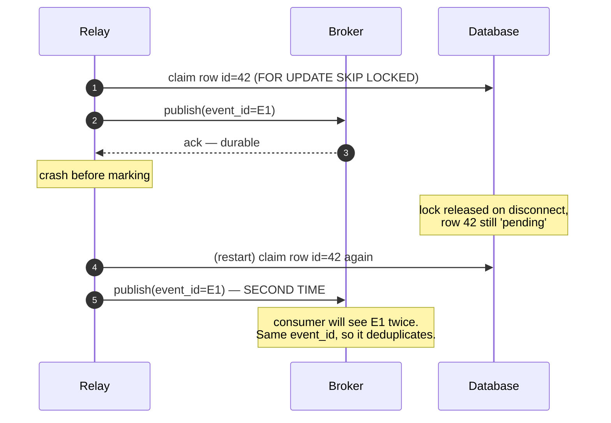

**This window cannot be closed.** Closing it would require an atomic commit
across the broker and the database, which is where we started
([§2](#2-why-not-two-phase-commit)). Every implementation of this pattern —
polling, CDC, in any language, at any company — has this window.

That is why the pattern is *at-least-once*, why `event_id` must be stable, and
why the consumer side of this document is not optional.

### Wait for the acknowledgement

`await ack` is not a stylistic detail. Fire-and-forget publishing plus "mark
published" loses messages: the relay records success, the broker never durably
had the message, and the row is gone from the pending set forever.

| Broker | What "durably accepted" requires |
|---|---|
| **Kafka** | `acks=all` plus `min.insync.replicas >= 2`; block on the send future or the callback before marking. Also set `enable.idempotence=true` — the default since Kafka 3.0 (and reliably in effect only from 3.2, per KAFKA-13598), but older clients and explicit overrides still ship `acks=1`, so set it rather than assume it. |
| **RabbitMQ** | Publisher confirms enabled; wait for `basic.ack`. Publish to a durable exchange, with `delivery_mode=2` (persistent) and a durable queue bound. |
| **Redis Streams** | `XADD` is synchronous and returns the entry id. Note Redis replication is asynchronous by default, so a failover can lose recently acked writes — use `WAIT` if that matters. |
| **SQS** | The `SendMessage` response is the durability confirmation. |

Kafka's idempotent producer deduplicates *retries within a producer session*
using a producer id and sequence numbers. It does not survive a producer restart,
and it says nothing about the relay's crash window. It reduces duplicates; it
does not eliminate the need for consumer deduplication.

### Batch size

| Smaller batches (~50) | Larger batches (~1000) |
|---|---|
| Shorter transactions, less lock time | Fewer round trips, higher throughput |
| Smaller duplicate window on crash | Larger duplicate window on crash |
| More database round trips per message | More memory per relay pass |

100–500 is the usual sweet spot. Measure with your payload sizes; the right
number is where throughput stops improving.

Two structural choices exist, and the trade-off is worth knowing:

- **Publish inside the claiming transaction** (the loop above). Rows stay locked
  while publishing, so no other relay can touch them. Simple and safe. Cost: the
  transaction stays open across network calls, so keep batches modest.
- **Claim, commit, publish, then mark in a second transaction.** Short database
  transactions, but a crash between publishing and marking is now guaranteed to
  produce redelivery for the whole in-flight batch rather than one row, and
  another relay can claim rows the first is still publishing unless you keep a
  `claimed` state.

Start with the first. Move to the second only when transaction duration shows up
in your database metrics.

### Latency: idle backoff and notifications

An empty poll should sleep, or you will burn a database core doing nothing:

- Sleep with **jitter** (e.g. random 50–500 ms) so multiple relays and restarts
  do not synchronise into thundering herds.
- Consider a **short adaptive backoff**: sleep 50 ms after a full batch (there is
  probably more), 500 ms–2 s after several empty polls.

To cut latency to near zero without polling harder, have the producer signal the
relay after commit. In PostgreSQL:

```sql
-- producer, immediately after COMMIT (or in an AFTER INSERT trigger)
NOTIFY outbox_new;
```

```
-- relay
LISTEN outbox_new;
wait_for_notification(timeout = idle_backoff)   -- returns early on NOTIFY
```

This is **an optimisation and never the delivery path**. Notifications are not
durable and are not delivered to a listener that was disconnected when they were
sent. The poll loop with its timeout remains the source of truth; the
notification only wakes it sooner.

> **The notify queue can fail your producers.** PostgreSQL's `NOTIFY` queue is
> shared and finite (`max_notify_queue_pages`, 8 GB in a default build). It can
> only be trimmed past the position of the *slowest* listener, so a session that
> executes `LISTEN` and then sits in a long-running transaction prevents cleanup.
> When the queue fills, transactions that call `NOTIFY` **fail at commit** with
> `too many notifications in the NOTIFY queue` — meaning a wedged relay can start
> failing business writes. This is the opposite of what the outbox is for.
>
> If you use `LISTEN`/`NOTIFY`, keep the relay's listening connection out of long
> transactions, and monitor `pg_notification_queue_usage()`. If that trade is
> unattractive, drop the notification entirely and accept polling latency — the
> pattern does not need it.

### Classifying errors

Getting this wrong is the most common relay bug in production.

| Class | Examples | Response |
|---|---|---|
| **Transient** | Broker unreachable, timeout, leader election, `NOT_ENOUGH_REPLICAS`, 503 | Do **not** burn `attempts`. Back off the whole batch and retry — the broker being down is not this message's fault. |
| **Permanent** | Message larger than the broker's limit, unknown topic with auto-creation disabled, serialisation failure, authorisation denied | Retrying forever will never succeed. Dead-letter the row immediately and alert ([§10](#10-poison-entries-and-the-producer-side-dead-letter)). |

A relay that treats a broker outage as a per-message failure will exhaust
`attempts` on thousands of perfectly good rows and dead-letter your entire
backlog. A relay that treats an oversized message as transient will retry it
until someone notices, blocking that key's ordering the whole time.

Back off exponentially with jitter:
`backoff(n) = min(cap, base * 2^n) * random(0.5, 1.5)`, e.g. `base = 1s`,
`cap = 5min`.

## 8. Running more than one relay

`SKIP LOCKED` makes concurrent relays *safe* — they never publish the same row.
It does not make them *ordered*: two relays can publish two events for the same
aggregate at the same time, and they may reach the broker in either order.

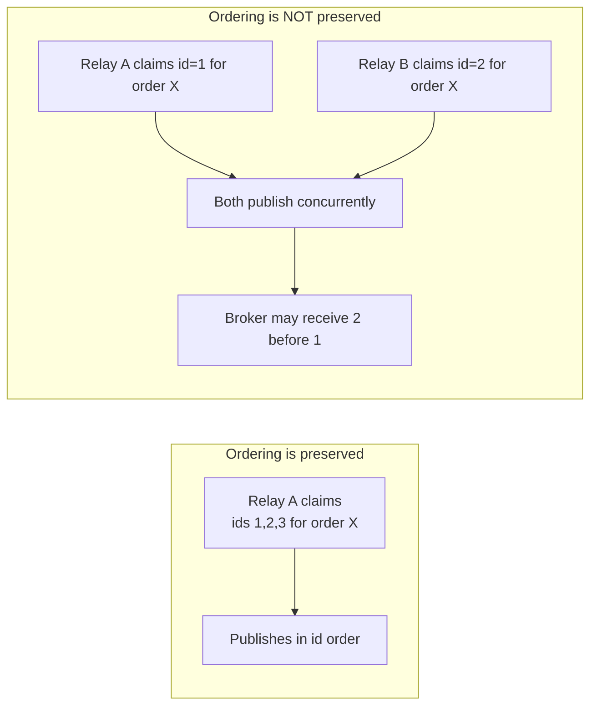

Three deployment shapes:

| Shape | Ordering | Throughput | Complexity |
|---|---|---|---|
| **Single active relay, hot standby** *(recommended default)* | Per-aggregate order guaranteed | One process's worth | Lowest |
| **Sharded relays** by `hash(aggregate_id) % N` | Guaranteed, because one shard owns each key | Scales with N | Moderate |
| **N unrestricted relays** | Not guaranteed | Scales with N | Lowest, but only valid if consumers are order-insensitive |

### Single active with hot standby

Run several instances; let exactly one hold a lock and do the work, while the
others block waiting to take over on failure. In PostgreSQL a session-level
advisory lock is ideal — it is held by a connection and released automatically
when that connection dies:

```sql
SELECT pg_try_advisory_lock(4815162342);   -- true => I am the relay
-- ... run the loop ...
SELECT pg_advisory_unlock(4815162342);     -- or just disconnect
```

Kubernetes `Lease` objects or a lease row with a heartbeat work equally well.
Whatever you use, ensure the standby cannot start until the previous holder's
lease has genuinely expired, and that the loop re-checks it is still the holder
before each batch.

### Sharded relays

```sql
-- relay instance k of n
... WHERE status = 'pending'
      AND available_at <= now()
      AND abs(hashtext(aggregate_id)) % :n = :k
```

Each aggregate maps to exactly one relay, so per-aggregate order holds while
throughput scales. Add an index on the hash expression if the table is large.
Note that `hashtext()` is an internal, undocumented PostgreSQL function whose
results are not guaranteed stable across major versions — for anything long-lived
prefer a shard column computed by the application at insert time, which is also
indexable without an expression index.
Note that resharding (changing `n`) needs a brief pause of all relays to avoid a
window where two instances both consider themselves the owner of a key.

### Capacity

Rough arithmetic before you build for scale you do not have: one relay, batch
size 200, ~15 ms to publish and commit a batch, ≈ 13,000 messages/second — an
order of magnitude beyond most services. Round trips to the database and broker
dominate, not row count. Measure before sharding; a single relay is usually
enough for a very long time.

## 9. Ordering

Per-aggregate FIFO ordering — every event for order `9f3c` arriving in the order
it happened — holds only if **all four** of these are true:

1. **Insert order is correct.** Guaranteed: events for one aggregate are written
   in one transaction, or in later transactions with higher `id`s.
2. **The relay publishes in `id` order** and does not run concurrently for the
   same key ([§8](#8-running-more-than-one-relay)).
3. **The same key goes to the same partition.** Set the broker's partition key to
   `aggregate_id`. Without this, ordering was lost in the broker no matter what
   the relay did.
4. **The consumer processes one partition sequentially.** Fan-out to a thread
   pool within a partition destroys the order the first three steps preserved
   ([§14](#14-acknowledgement-and-delivery-semantics)).

**Global ordering across all aggregates is not available**, and you should not
want it: it serialises the entire system through one partition and one consumer.
Per-key ordering is what business logic actually needs.

### Two things that quietly break it

**Asynchronous publishing.** Pipelining sends for throughput lets message 2
overtake message 1 after a retry. With Kafka, `enable.idempotence=true` preserves
order for up to `max.in.flight.requests.per.connection=5`; without idempotence,
set it to 1 or publish synchronously.

**Retry backoff.** `available_at = now() + backoff` moves a failed event behind
later events for the same aggregate. If strict ordering matters for that
aggregate, the failed event must **block its key** rather than let successors
overtake it:

```sql
-- publish nothing for an aggregate that has an older un-published row
AND NOT EXISTS (
    SELECT 1 FROM outbox blocked
     WHERE blocked.aggregate_id = outbox.aggregate_id
       AND blocked.status = 'pending'
       AND blocked.id < outbox.id
)
```

That is head-of-line blocking, and it is a real cost: one stuck event stalls that
aggregate until it is resolved or dead-lettered. Take it only where order is
genuinely required.

### The pragmatic alternative: versions

Rather than fighting for perfect ordering everywhere, let consumers detect and
discard stale events. Carry the aggregate's version in the payload and have the
consumer apply last-writer-wins:

```sql
UPDATE order_projection
   SET status = :status, version = :version
 WHERE order_id = :id
   AND version < :version;      -- older events are silently ignored
```

This is robust against reordering, duplicates and replays at once, and it is what
most production systems actually rely on. Use it for projections and state
mirrors. It does not help for events that are inherently sequential and
non-idempotent (`amount_added`), which is an argument for modelling those as
absolute states rather than deltas.

## 10. Poison entries and the producer-side dead letter

A **poison entry** is an outbox row that will never publish successfully:
a payload above the broker's size limit, a topic that does not exist, a
serialisation bug, a revoked ACL.

The policy:

1. Classify the error ([§7](#classifying-errors)). Permanent errors go
   straight to `failed`; transient errors get `attempts + 1` and backoff.
2. On `attempts >= max_attempts` (5–10 is typical, spanning minutes to hours),
   set `status = 'failed'` and stop retrying.
3. **Alert on any row reaching `failed`.** Unlike consumer dead letters, a failed
   outbox row means an event that has never reached the broker at all. It is
   data loss in waiting.
4. Keep the row. It carries the payload, the headers, `attempts` and
   `last_error` — everything needed to diagnose and replay.

```sql
-- the operator's dashboard query
SELECT id, event_type, aggregate_id, attempts, last_error, occurred_at
  FROM outbox
 WHERE status = 'failed'
 ORDER BY id;
```

Replay after a fix is a single statement — and because `event_id` is unchanged,
any consumer that somehow did receive the event will deduplicate it:

```sql
UPDATE outbox
   SET status = 'pending', attempts = 0, available_at = now(), last_error = NULL
 WHERE id = :id;
```

Retain `failed` rows far longer than published ones (months, not days). They are
the record of what your system failed to say.

## 11. Transaction log tailing (CDC)

The second textbook implementation of the relay. Instead of polling a table, read
the database's own replication log.

### How it works

Every durable database already writes an ordered log of committed changes —
PostgreSQL's write-ahead log, MySQL's binlog, MongoDB's oplog — because
replication and crash recovery depend on it. A change-data-capture connector
(**Debezium** is the de facto standard) subscribes to that log as if it were a
replica and emits each committed row change as a message.

Applied to the outbox, this means: the application still inserts outbox rows in
its business transaction, exactly as in [§5](#5-writing-the-event-in-the-same-transaction).
Nothing on the producing end changes. Only the relay does — it becomes
infrastructure you configure rather than code you write.

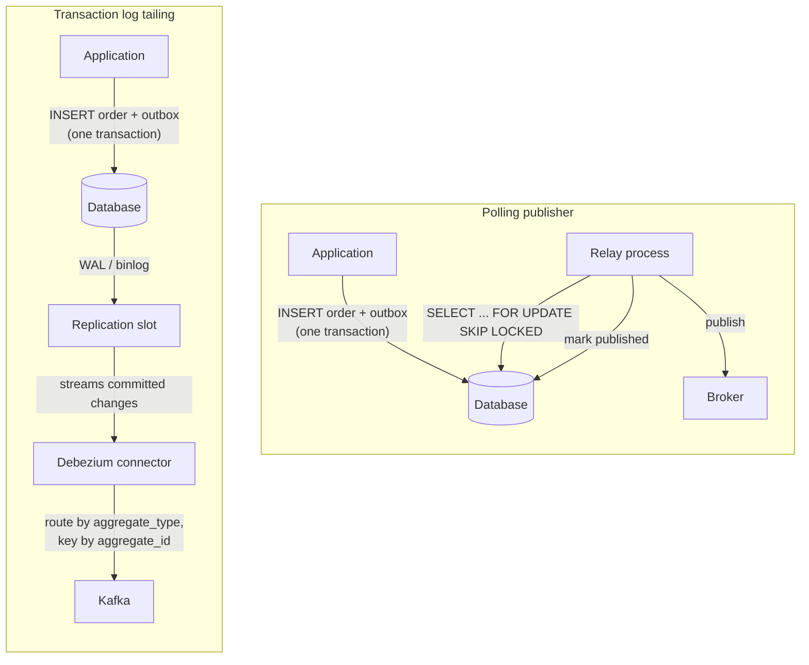

### The outbox event router

Debezium ships an `EventRouter` single-message transform built for exactly this
table. It takes the raw row-change event and turns it into a proper domain
message: the destination topic comes from `aggregate_type`, the message key from
`aggregate_id`, the body from `payload`, and remaining columns become headers.
Consumers see clean domain events, not database row diffs.

> **The router expects its own column names.** By default the SMT assumes the
> outbox table has columns `id` (the event UUID), `aggregatetype`, `aggregateid`,
> `type` and `payload`. The schema in [§4](#the-schema) deliberately uses
> `event_id`, `aggregate_type`, `aggregate_id` and `event_type` instead — and note
> the collision: Debezium's `id` is the *event UUID*, while this schema's `id` is
> the bigserial sequence and `event_id` holds the UUID. Wiring the two together
> without remapping would publish the wrong value as the event id and break
> consumer deduplication. Every column name is remappable
> (`table.field.event.id`, `table.field.event.type`, `table.field.event.payload`,
> `route.by.field`, and so on) — set them explicitly rather than relying on the
> defaults matching.

Two things follow:

- **Only `INSERT`s matter.** The router is configured to ignore deletes.
- **You can delete the row immediately.** `INSERT` then `DELETE` in the same
  transaction leaves the table permanently empty while the WAL still carries the
  insert. Debezium reads it from the log. Zero table growth and no purge job.
  The costs: you lose all operational visibility into the table (there is nothing
  to `SELECT`), and PostgreSQL needs `REPLICA IDENTITY` set appropriately for the
  delete records. Dead tuples still accrue and autovacuum still has work to do.

### Direct CDC on domain tables — a different pattern

You can also point CDC at the `orders` table itself and skip the outbox
entirely. It is less work, and it is usually the wrong contract:

- Events become row diffs. Your table schema becomes your public API; a column
  rename breaks consumers.
- **Intent is lost.** `status: 'pending' -> 'cancelled'` cannot tell a consumer
  whether the customer cancelled, fraud rejected it, or payment expired. Those
  are different events with different consequences.
- One business operation touching three tables emits three unrelated messages
  with no obvious relationship.

Use direct CDC for replication, analytics pipelines and data lakes. Use the
outbox for integration events between services.

### What CDC buys, and what it costs

| Advantages | Costs |
|---|---|
| No polling load on the database | Substantial infrastructure: Kafka Connect (or the embedded engine), connector configuration, monitoring |
| Latency in single-digit milliseconds | Elevated database privileges: a replication role, `wal_level=logical`, publications and slots |
| No relay code to write, test or operate | **Replication slot risk** — see below |
| Order follows the WAL exactly, with no relay concurrency questions | Kafka-centric in practice; other brokers need a sink connector |
| Cannot suffer the cursor-visibility bug ([§4](#the-visibility-gap--why-status-beats-a-cursor)) | Harder local development and integration testing |
| Reads no rows, so it does not compete with application queries | Some managed/hosted databases restrict or disallow logical replication |

> **The replication slot is the thing that will page you.** A PostgreSQL logical
> replication slot guarantees the WAL is retained until the consumer has
> confirmed it. If the connector stops — crashed, misconfigured, or simply
> forgotten after a decommission — WAL accumulates indefinitely and **fills the
> database's disk, taking the database down**. This is the most common CDC
> outage in the wild. Always monitor slot lag
> (`pg_replication_slots.confirmed_flush_lsn` versus current LSN), set
> `max_slot_wal_keep_size` as a backstop, and drop slots the moment a connector
> is retired.

CDC is still **at-least-once**: a connector restart resumes from its last
committed offset and re-emits anything after it. Consumers still deduplicate.
The pattern's contract does not change — only the machinery does.

### Choosing polling or CDC

| Choose **polling** when | Choose **CDC** when |
|---|---|
| You want zero additional infrastructure | You already run Kafka Connect and Debezium |
| Throughput is moderate (up to a few thousand msg/s) | Volume is high enough that polling load matters |
| 100 ms–1 s of publish latency is fine | You need consistently low latency |
| Your broker is RabbitMQ, Redis, SQS, or anything but Kafka | Your platform is Kafka-centric |
| The team is small and operational surface area is precious | You have platform engineers who run this already |
| You want to debug by reading a table | You are willing to debug by reading connector metrics |

Both are correct implementations of the same pattern, described side by side in
the literature (`microservices.io`: *Polling Publisher* and *Transaction Log
Tailing*). **Start with polling.** It is a few hundred lines you fully
understand, and the producer-side code is identical, so migrating to CDC later
changes no application code at all.

---

# Part IV — The consuming end

The producing end guarantees that every committed change is published *at least
once*. The consuming end is where "at least once" is turned into a system that
behaves correctly. Skipping this half does not give you a partly-correct system;
it gives you an incorrect one with a well-built first half.

## 12. Idempotent consumers

**The rule:** processing the same message twice must leave the system in the same
state as processing it once.

Duplicates arrive for reasons that are all normal operation, not malfunction:

- The relay's crash window ([§7](#the-crash-window--the-crux-of-the-whole-pattern)).
- A consumer that processed a message and died before acknowledging it.
- A broker rebalance that reassigns a partition whose offsets were not yet
  committed.
- A visibility timeout expiring while the message was still being processed.
- A deliberate replay after fixing a bug.

Three ways to achieve idempotency, best first:

### 1. Naturally idempotent operations

The cheapest idempotency is the kind that needs no bookkeeping. Prefer absolute
assignments and upserts over deltas:

```sql
-- idempotent: absolute state
UPDATE orders SET status = 'shipped' WHERE order_id = :id;

-- idempotent: upsert keyed by business identity
INSERT INTO order_projection (order_id, status, total_cents, version)
VALUES (:id, :status, :total, :version)
ON CONFLICT (order_id) DO UPDATE
   SET status = EXCLUDED.status,
       total_cents = EXCLUDED.total_cents,
       version = EXCLUDED.version
 WHERE order_projection.version < EXCLUDED.version;   -- also handles reordering

-- NOT idempotent: a delta. Twice = wrong balance.
UPDATE accounts SET balance = balance + 1000 WHERE id = :id;
```

The delta case is the classic trap. Where the domain permits it, model the
outcome (`balance_after`) rather than the change (`amount_added`), or record the
transaction as a row keyed by `event_id` and derive the balance.

### 2. A unique constraint on the business key

Let the database reject the duplicate:

```sql
CREATE UNIQUE INDEX shipment_per_order ON shipments (order_id);

INSERT INTO shipments (order_id, ...) VALUES (:order_id, ...)
ON CONFLICT (order_id) DO NOTHING;
```

Zero extra tables and the constraint documents the business rule. Works when the
event maps to at most one row.

### 3. An explicit inbox

Required when the effect is neither naturally idempotent nor constrained by a
unique business key — sending an email, calling a payment API, incrementing a
counter, appending to a ledger. This is [§13](#13-the-inbox-pattern).

### Choosing the right mechanism

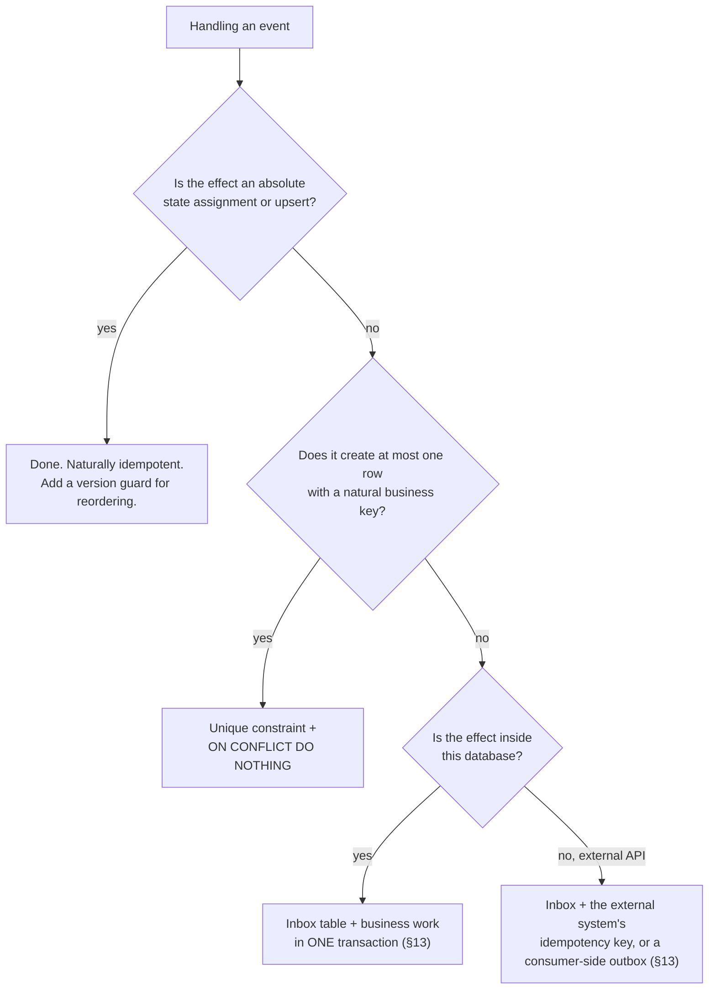

## 13. The inbox pattern

Also called the *idempotent receiver* (Hohpe & Woolf) or a processed-messages
table. It is the mirror image of the outbox: a table in the consumer's database
that records which messages have been handled, written **in the same transaction
as the work itself**.

### The inbox schema

```sql
CREATE TABLE inbox (
    consumer      TEXT        NOT NULL,   -- logical consumer name
    event_id      UUID        NOT NULL,   -- from the message envelope
    event_type    TEXT        NOT NULL,   -- diagnostics only
    processed_at  TIMESTAMPTZ NOT NULL DEFAULT now(),
    PRIMARY KEY (consumer, event_id)
);

CREATE INDEX inbox_processed_at_idx ON inbox (processed_at);  -- for purging
```

`consumer` is part of the key because several logical consumers may share one
database and each must process the event independently. If a database serves
exactly one consumer, `event_id` alone as the primary key is fine.

### The transaction

```
on_message(msg):

    begin transaction

        inserted = INSERT INTO inbox (consumer, event_id, event_type)
                   VALUES (:consumer, :event_id, :event_type)
                   ON CONFLICT DO NOTHING
                   -- rows affected: 1 = new, 0 = already processed

        if inserted == 0:
            commit
            broker.ack(msg)          # duplicate: acknowledge and move on
            metrics.duplicates_skipped += 1
            return

        handle(msg)                  # all business work, SAME transaction

    commit                           # <- inbox row and work commit together

    broker.ack(msg)                  # only after the commit succeeds
```

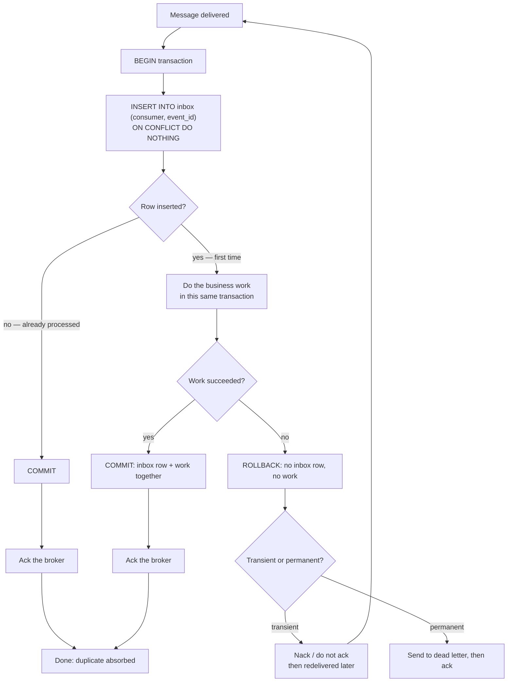

### Why atomicity here is not optional

Splitting the inbox write from the work reintroduces the dual-write problem on
the consuming end:

| Wrong shape | What breaks |
|---|---|
| Mark processed, *then* do the work | A crash in between loses the work permanently. The message is already marked processed, so redelivery deduplicates it away. **Silent data loss.** |
| Do the work, *then* mark processed | A crash in between reprocesses the work on redelivery — the exact problem the inbox was added to solve. |
| Mark processed in Redis, do the work in Postgres | Two systems, no shared transaction. You are back at [§1](#1-the-dual-write-problem). |

One transaction. Both writes. No exceptions.

### Ack after commit, never before

The order is: commit the database transaction, *then* acknowledge the broker. A
crash between them causes redelivery, the inbox insert conflicts, the duplicate
is skipped, and the message is acknowledged. That is the design working exactly
as intended — the redundant delivery is absorbed by the mechanism built for it.

Acknowledging first turns a crash into permanent loss.

### Choosing the deduplication key

| Key | Deduplicates | Use when |
|---|---|---|
| **`event_id`** | Redeliveries and relay retries of the *same* message | The default. Universal, requires no domain knowledge. |
| **Business key** (`order_id`, or `payment_id + attempt_no`) | The above, *plus* semantically-duplicate events published with different ids | The operation must happen at most once regardless of how many events describe it — payments, shipments, external calls. |
| **`(aggregate_id, version)`** | The above, plus stale reordered events | Projections and state mirrors, where you want last-writer-wins anyway. |

`event_id` is the baseline; the others are stronger and worth reaching for
wherever the operation is expensive or externally visible.

### Retention

Inbox rows cannot be kept forever, but the window must exceed the longest
realistic gap between two deliveries of the same message:

```
window > broker_retention + max_replay_lag + max_outage_duration
```

7 days is a common floor; 30 days is comfortable. Purge in bounded batches
([§18](#18-operating-the-pattern)).

Be explicit about the consequence: **an event replayed after its inbox row is
purged will be processed again.** For a deliberate replay that is usually the
point. For an accidental one — someone resets a consumer group to the earliest
offset on a topic with 90-day retention while the inbox keeps 7 days — it is an
incident. Retention is not just storage hygiene; it is the boundary of your
deduplication guarantee, and it should be written down.

### Alternatives, and their traps

- **Redis `SET key NX EX`.** Fast, and *not transactional with your database*. A
  crash between the Redis mark and the database commit either loses the work or
  reprocesses it. Acceptable only when the work is naturally idempotent anyway —
  in which case you did not need it.
- **Bloom filters.** Probabilistic, with false *positives*, meaning
  "already processed" for a message that was not. That is silent event loss.
  Never use one as a correctness mechanism.
- **The broker's own deduplication.** SQS FIFO deduplicates over a 5-minute
  window; Kafka's idempotent producer deduplicates within a producer session.
  Both windows are far shorter than a relay retry after an outage. Useful noise
  reduction, not a correctness guarantee.

### When the side effect is external

If the handler must call an outside system — charge a card, send an email — that
call cannot join the database transaction. Two remedies:

1. **Use the external system's idempotency key.** Well-designed APIs accept one
   (Stripe's `Idempotency-Key` is the reference example). Pass the `event_id` or
   a value derived from it; the provider deduplicates on their side. This is the
   preferred route whenever it is available.
2. **Give the consumer its own outbox.** Record the intent transactionally, and
   let a relay perform the external call with retries. The pattern composes:
   consume → record → outbox → relay → external system. The dual write is pushed
   to the one place that can absorb it.

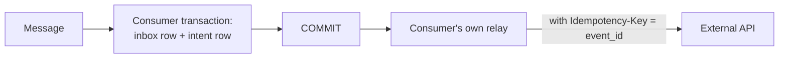

## 14. Acknowledgement and delivery semantics

### The universal rules

1. **Acknowledge after the work is committed.** Never before.
2. **Disable auto-acknowledgement and auto-offset-commit.** Both acknowledge on a
   timer or on delivery, regardless of whether processing succeeded — a
   ready-made data-loss bug.
3. **Bound processing time.** Every broker has a lease (visibility timeout,
   `max.poll.interval.ms`, consumer timeout). Exceed it and the message is
   redelivered *while you are still processing it*, producing concurrent
   duplicate work.

### Per broker

| Broker | Acknowledge with | Redelivery triggered by | In-flight recovery |
|---|---|---|---|
| **Kafka** | Commit the offset after processing (`enable.auto.commit=false`) | Uncommitted offsets after a rebalance or restart | Partition reassignment; keep processing under `max.poll.interval.ms` or pause the partition |
| **RabbitMQ** | `basic.ack` after commit; `basic.nack(requeue=false)` to dead-letter | Channel close, connection loss, `nack` with requeue, consumer timeout | Unacked messages are requeued when the channel dies; bound with `prefetch` |
| **Redis Streams** | `XACK` after commit | Entries left in the Pending Entries List | `XPENDING` + `XAUTOCLAIM` to take over messages from a dead consumer after a min-idle-time |
| **SQS** | `DeleteMessage` after commit | Visibility timeout expiry | Extend with `ChangeMessageVisibility` heartbeats for long work |

Kafka deserves a note: offsets are a *high-water mark per partition*, not
per-message acknowledgements. Committing offset 105 declares everything below it
done. So a partition must be processed in order, and out-of-order completion
within a partition is not expressible. That is a constraint, but it is also
precisely what preserves the ordering established in [§9](#9-ordering).

### Concurrency versus ordering

Parallelism inside a partition destroys the ordering the whole producing end
worked to preserve. The standard resolution — group by key, parallel across
groups, sequential within one:

```
batch = poll()
groups = batch.group_by(msg -> msg.key)          # key = aggregate_id
parallel_for group in groups:                    # different aggregates: parallel
    for msg in group:                            # same aggregate: strictly ordered
        handle(msg)
commit_offsets(batch)                            # after all groups finish
```

Scale by adding partitions and consumers, not threads inside a partition. Note
that partition count is the ceiling on consumer parallelism in a Kafka consumer
group: with 12 partitions, the 13th consumer sits idle.

## 15. Retries, dead letters and replay

### Classify before retrying

The same distinction as the relay ([§7](#classifying-errors)), and the same
consequences for getting it wrong:

| Class | Examples | Response |
|---|---|---|
| **Transient** | Deadlock, timeout, downstream 503, connection reset | Retry with exponential backoff and jitter. |
| **Permanent** | Schema validation failure, unknown event type, referenced entity permanently absent, a bug | Do not retry. Dead-letter immediately. |

Retrying a permanent failure forever is a livelock: the consumer makes no
progress, the partition never advances, lag grows without bound, and — with
ordering enforced — every later message for that key is blocked behind it. It
looks like an outage, and the cause is a message that was never going to succeed.

### The retry ladder

1. **In-process retries** — 2–3 attempts over a few hundred milliseconds, for
   deadlocks and blips.
2. **Delayed redelivery** — hand the message back with an increasing delay, so
   the consumer keeps making progress on other messages. Kafka: dedicated retry
   topics (`orders.retry.5s`, `orders.retry.1m`, `orders.retry.10m`) each consumed
   by a delaying consumer. RabbitMQ: a queue with a message TTL whose dead-letter
   exchange routes back to the main queue. SQS: `ChangeMessageVisibility`.
3. **Dead letter** — after N ladder steps, park it.

Note that delayed redelivery reorders that key's stream. Where order must hold,
you must block the key instead and accept head-of-line blocking. The choice is
per event type, not global.

### The dead-letter queue

A dead letter must carry enough to diagnose without the original context:

- the original payload, unmodified;
- all original headers, including `event_id`, `traceparent` and `correlation_id`;
- the failure reason, exception type and stack trace;
- the consumer name, hostname and version;
- the timestamp and the number of attempts made.

> **A dead-letter queue nobody watches is a delete key with extra latency.**
> Alert on depth greater than zero. Every message in it is a business fact that
> was published successfully and never acted upon.

### Replay

Replay is the reason for keeping `event_id` stable everywhere:

- **From the DLQ**, after fixing the consumer: republish the original messages to
  the main topic. The inbox deduplicates anything that had in fact succeeded.
- **From the source topic**, by resetting a consumer group's offsets — for
  rebuilding a projection or backfilling a new consumer.
- **From the producer's outbox**, for `failed` rows ([§10](#10-poison-entries-and-the-producer-side-dead-letter)).

Two things make replay safe, and both were designed in earlier:

1. The inbox row is written **in the same transaction as the work**, so a failed
   attempt leaves no row and replay proceeds normally. Had the inbox been marked
   before the work, replay would deduplicate away messages that were never
   actually processed.
2. `event_id` is stable, so successful work is not repeated.

Before a large replay, check the inbox retention window: anything older than it
will be reprocessed rather than deduplicated.

## 16. Exactly-once, honestly

**Exactly-once *delivery* is impossible** in an asynchronous network where
processes can fail. The sender cannot distinguish "the message was lost" from
"the acknowledgement was lost", so it must choose: retry (risking duplicates) or
not (risking loss). This is the Two Generals problem, and no protocol escapes it.

What real systems provide is **exactly-once *processing***, and only under
constraints:

- **Kafka's transactions / EOS** give atomic read-process-write *entirely within
  Kafka* — consume from a topic, produce to a topic, commit offsets, all atomic.
  The moment your side effect is a row in PostgreSQL, it is outside the
  transaction and the guarantee no longer covers it. Kafka EOS does not solve the
  dual write; it solves a different problem inside Kafka's boundary.
- **Flink, Kafka Streams and similar** achieve it through checkpointed state plus
  transactional sinks — again, only for effects inside systems participating in
  the checkpoint.

So the honest description of what a correctly built outbox system provides:

> **At-least-once delivery, plus idempotent processing, equals effectively-once
> outcomes.**

The duplicates are real; they arrive; they are absorbed by design. That is not a
compromise or an approximation — it is the standard answer, the one described in
*Designing Data-Intensive Applications* and implemented by essentially every
large system that moves events between services.

When someone asks whether your pipeline is exactly-once, the correct answer is:
*"At-least-once delivery with idempotent consumers, so effects happen once."*
Anyone claiming exactly-once delivery across two systems is describing something
that does not exist.

---

# Part V — Reality

## 17. Broker comparison

The pattern is broker-agnostic — the relay publishes, the consumer acknowledges.
What differs is the vocabulary and the guarantees each broker attaches to those
two verbs.

| | **Kafka** | **RabbitMQ** | **Redis Streams** | **SQS (standard)** |
|---|---|---|---|---|
| **Model** | Partitioned, replayable log | Queues fed by exchanges | Append-only log with consumer groups | Distributed queue |
| **Ordering unit** | Partition | Queue, with a single consumer | Stream; **not** preserved across group members | None (FIFO variant: message group) |
| **Partition key** | Message key → hash → partition | Routing key selects a queue, not order | None; shard by stream name | FIFO: `MessageGroupId` |
| **Producer durability** | `acks=all` + `min.insync.replicas` | Publisher confirms + durable exchange/queue + persistent delivery mode | `XADD`; replication is async by default | `SendMessage` response |
| **Acknowledgement** | Offset commit (high-water mark per partition) | `basic.ack` per message | `XACK` per entry | `DeleteMessage` per message |
| **Redelivery trigger** | Rebalance/restart with uncommitted offsets | `nack`, channel loss, consumer timeout | Entry left in the Pending Entries List | Visibility timeout expiry |
| **Recover from a dead consumer** | Partition reassignment | Automatic requeue of unacked messages | `XPENDING` + `XAUTOCLAIM` | Automatic after visibility timeout |
| **Dead-letter support** | Build it (a `.dlq` topic); Connect has a DLQ | Native dead-letter exchanges | Build it (a dead stream) | Native, with a redrive policy |
| **Retention / replay** | Time or size based; replay by seeking offsets | None — consumed messages are gone | `MAXLEN`/`MINID` trimming; replay by id range | 4 days default, 14 max; no replay after delete |
| **Native deduplication** | Idempotent producer, within a session | None (a plugin exists) | None | FIFO only: 5-minute window |
| **Fit for CDC / Debezium** | Native and excellent | Via a sink connector | Uncommon | Via a sink connector |
| **Best suited to** | Event streams, replay, high volume, CDC | Task queues, routing, per-message control | Small/medium deployments already using Redis | AWS-native, operationally free |

Reading the table with the pattern in mind:

- **Every one of them is at-least-once at best.** Nothing in this table removes
  the need for an inbox.
- **Only Kafka and Redis Streams retain messages after consumption**, so only
  they support replay from the broker. With RabbitMQ or SQS, your replay source
  is the producer's outbox or the DLQ.
- **Ordering is easiest on Kafka** (key → partition, natural), needs care on
  RabbitMQ (one consumer per queue, or sharded queues), and is essentially
  unavailable across a Redis consumer group.
- **Dead-lettering is native** on RabbitMQ and SQS, and something you build on
  Kafka and Redis.
- **SQS FIFO's 5-minute deduplication window** is far shorter than a relay retry
  after a broker outage. Do not treat it as your deduplication layer.

## 18. Operating the pattern

### The metrics that matter

**Producer side**

| Metric | Why | Alert |
|---|---|---|
| **Age of the oldest pending row** | The single best health signal. It catches a stopped relay, a wedged loop, a broker outage and a head-of-line block — all of them, immediately. | Page above ~60 s (tune to your latency budget) |
| Pending row count | Backlog depth and growth rate | Warn on sustained growth |
| Publish rate and error rate | Throughput and broker health | Warn on error-rate spike |
| Rows in `failed` | Events that will never be sent without intervention | Ticket on any, page if growing |
| Relay loop duration, batch fill ratio | Whether batch size and backoff are tuned | — |
| Outbox table size and dead-tuple ratio | Purge and vacuum health | Warn on growth without bound |
| Replication slot lag *(CDC only)* | An abandoned slot fills the disk and takes the database down | **Page** |

If you instrument one thing, instrument the age of the oldest pending row:

```sql
SELECT COALESCE(EXTRACT(EPOCH FROM now() - MIN(occurred_at)), 0) AS oldest_pending_seconds
  FROM outbox
 WHERE status = 'pending';
```

**Consumer side**

| Metric | Why |
|---|---|
| Consumer lag / queue depth | Are you keeping up? |
| Processing latency p50/p99 | Must stay well under the broker's lease timeout |
| End-to-end latency (`now - occurred_at`) | What the business actually experiences |
| Retry rate | Rising retries precede outages |
| DLQ depth | **Alert on greater than zero** |
| Duplicate rate (inbox conflicts) | Normal at a low level; a spike means the relay is churning or a consumer is dying mid-batch |

### Purging

Retention, by table:

| Table | Typical retention | Reason |
|---|---|---|
| `outbox` where `status = 'published'` | 3–7 days | Incident forensics |
| `outbox` where `status = 'failed'` | 90 days | Unresolved data loss; keep the evidence |
| `inbox` | 7–30 days | Must exceed the redelivery window ([§13](#retention)) |

Delete in bounded batches. A single unbounded `DELETE` on a hot table takes long
locks, generates enormous WAL, and can stall the relay:

```sql
-- repeat until zero rows affected, with a short pause between iterations
DELETE FROM outbox
 WHERE id IN (
     SELECT id FROM outbox
      WHERE status = 'published'
        AND published_at < now() - INTERVAL '7 days'
      ORDER BY id
      LIMIT 10000
 );
```

At high volume, **partition by day and drop partitions** instead. Dropping a
partition is a metadata operation: instant, no WAL, no dead tuples, no vacuum.

```sql
-- NOTE the key changes: a partitioned table's primary key and any unique
-- constraint MUST include every partition key column, so the single-column
-- PRIMARY KEY (id) and UNIQUE (event_id) of §4 are not legal here.
CREATE TABLE outbox (
    id           BIGSERIAL,
    event_id     UUID        NOT NULL,
    occurred_at  TIMESTAMPTZ NOT NULL DEFAULT now(),
    -- ... remaining columns as in §4 ...
    PRIMARY KEY (id, occurred_at),
    UNIQUE      (event_id, occurred_at)
) PARTITION BY RANGE (occurred_at);

CREATE TABLE outbox_2026_08_24 PARTITION OF outbox
    FOR VALUES FROM ('2026-08-24') TO ('2026-08-25');
-- later:
DROP TABLE outbox_2026_08_17;
```

Two consequences to accept deliberately before partitioning:

- **`event_id` is no longer globally unique.** `UNIQUE (event_id, occurred_at)`
  only prevents a collision *within* one partition. For producer-generated UUIDs
  the practical risk is nil, but the database has stopped guarding the value your
  consumers deduplicate on — a bug that inserts the same `event_id` on two days
  will no longer be rejected.
- **The relay's query cannot prune partitions.** It filters on `status` and
  `available_at`, not on `occurred_at`, so every partition's index is probed. The
  pending set is tiny, so this is usually acceptable — but it argues for keeping
  the number of live partitions small (drop aggressively) and for measuring the
  relay's claim latency after you partition, not before.

### PostgreSQL specifics

The outbox is one of the highest-churn tables you will own — every row is
inserted, updated once, and deleted. That behavior has consequences:

- **Autovacuum must keep up.** Tune it per table; the global defaults are far too
  lazy for this access pattern:

  ```sql
  ALTER TABLE outbox SET (
      autovacuum_vacuum_scale_factor = 0.02,   -- vacuum at 2% dead tuples
      autovacuum_vacuum_cost_delay   = 0,      -- do not throttle
      fillfactor                     = 85      -- room for in-page updates
  );
  ```

- **Do not expect HOT updates here.** PostgreSQL can only perform a heap-only
  tuple update when no indexed column changes — and for this purpose a partial
  index's *predicate* columns count as indexed, as do its key columns. In the
  schema of [§4](#the-schema), `outbox_pending_idx` keys on `available_at` and is
  predicated on `status`, so **both** relay updates — marking published, and
  bumping the retry backoff — touch the index and are never HOT. That is
  inherent, not a tuning mistake: the row must leave the pending index, and
  removing it is an index write by definition. Lowering `fillfactor` still helps
  by reducing page splits and leaving room for the new tuple version on the same
  page; it just will not buy you HOT. If index churn dominates at your volume,
  the fix is `DELETE`-on-publish ([§4](#keep-or-delete-published-rows)) or daily
  partitioning, not fillfactor.
- **Long transactions elsewhere in the database hold back vacuum here.** A
  forgotten idle-in-transaction session anywhere can bloat the outbox.
- **Migrate the table without blocking**: add nullable columns, backfill in
  batches, and always `CREATE INDEX CONCURRENTLY`. A plain `CREATE INDEX` takes a
  lock that stops the relay and every producer.

### Backpressure

When the broker is down, the outbox grows. **That is the pattern working** — the
database is absorbing an outage that would otherwise have failed your writes. But
it is not free, so decide in advance:

- How large can the backlog get before the disk is at risk?
- Is a growing backlog acceptable indefinitely, or should the service start
  shedding load or refusing writes at some threshold?
- How long will a drained backlog take to publish, and will that flood downstream
  consumers when the broker returns? Rate-limit the relay if a thundering drain
  would hurt.

Answer these before the incident, not during it.

### Deployment notes

- Run the relay as a separate deployment with its own scaling and its own
  alerting. Its liveness must reflect the loop actually making progress, not just
  the process being alive — a relay wedged on a dead connection passes a naive
  health check while publishing nothing.
- Shut down gracefully: finish the current batch, commit, release the lock.
  `SKIP LOCKED` makes an ungraceful kill safe, but graceful shutdown avoids a
  needless duplicate.
- One relay per database, per shard. Never point two relay deployments at one
  outbox unless you have deliberately sharded them ([§8](#8-running-more-than-one-relay)).

## 19. Failure-mode catalogue

Every meaningful failure, and what the pattern promises in each case.

| # | Failure | What happens | Guarantee |
|---|---|---|---|
| 1 | Crash before the business transaction commits | Nothing persisted, nothing published | **Consistent.** Client retries. |
| 2 | Crash during the commit | The database resolves it atomically | **Consistent.** Both rows or neither. |
| 3 | Crash after commit, before the relay runs | Row sits in `pending` | **No loss.** Published on the next pass. |
| 4 | Relay crashes after publishing, before marking | Row still `pending`; published again later | **Duplicate.** Consumer deduplicates by `event_id`. |
| 5 | Relay crashes while holding a claim | The database releases the lock on disconnect | **No stall.** Another relay picks it up. |
| 6 | Broker unavailable | Rows accumulate; writes keep succeeding | **No loss.** Latency and backlog only. |
| 7 | Relay process down entirely | Backlog grows | **No loss.** Caught by the oldest-pending-age alert. |
| 8 | Two relays publish the same row | Prevented by `SKIP LOCKED`; possible only if a lease expires early | **Duplicate.** Consumer deduplicates. |
| 9 | Message exceeds the broker's size limit | Permanent error → `failed` + alert | **Detected.** Never silently dropped. |
| 10 | Consumer crashes mid-processing | Transaction rolls back: no inbox row, no work, no ack | **Redelivered.** Processed on the next attempt. |
| 11 | Consumer crashes after commit, before ack | Redelivered; inbox insert conflicts | **Skipped.** Acknowledged and moved past. |
| 12 | Consumer processing exceeds the lease | Redelivered *while still processing* | **Concurrent duplicate.** Absorbed by the inbox; bound your processing time. |
| 13 | Consumer hits a permanent error | Dead-lettered after the retry ladder | **Parked, not lost.** Alert; replay after fixing. |
| 14 | Events for one aggregate arrive out of order | Possible with concurrent relays or retry backoff | **Mitigated** by version guards ([§9](#9-ordering)) or key blocking. |
| 15 | Same event replayed with a *new* `event_id` | `event_id` deduplication does not catch it | **Not protected.** Only business-key deduplication saves you — never regenerate ids. |
| 16 | Replay of an event older than the inbox retention window | No inbox row remains | **Reprocessed.** Usually intended; know your window. |
| 17 | Clock skew between application instances | Affects `available_at` scheduling only | **Ordering unaffected** — the relay orders by `id`, never by time. |
| 18 | Database disk fills from an unpurged outbox | Writes fail | **Availability incident.** Purge job and size alerts. |
| 19 | CDC replication slot abandoned | WAL retained forever, disk fills, database stops | **Severe outage.** Monitor slot lag; cap with `max_slot_wal_keep_size`. |
| 20 | Consumer processes correctly but the logic was wrong | No delivery failure at all | **Outside the pattern.** Fix and replay from the broker or the outbox. |

## 20. Edge cases and how to handle them

[§19](#19-failure-mode-catalogue) catalogues what happens when something on the
message path fails. This section covers what happens when something *around* it
does — infrastructure operations, deployment lifecycle, and semantic gaps that no
amount of relay correctness addresses. These are the ones teams discover in
production, usually at three in the morning, because they do not appear in any
diagram of the pattern.

### Infrastructure operations

#### Restoring the producer database (point-in-time recovery)

**Mechanism.** You restore to a point before the relay marked a batch published.
Those rows are `pending` again, so the relay republishes every event between the
restore target and the failure. Simultaneously, the business state has rolled
back while consumers' state has not — **consumers are now ahead of the producer**,
holding projections built from events whose source rows no longer exist.

**Mitigation.**

- Treat a restore as a deliberate mass replay, not a routine operation. **Stop
  the relay before opening the restored database to traffic**, inspect the
  pending set, and decide explicitly whether to publish it or mark it published
  without sending.
- Republication is absorbed by consumers only if the inbox retention window is
  longer than the restore gap. Restore 30 days back with 7-day inboxes and
  everything reprocesses.
- The harder half — consumers being ahead — is a **reconciliation** problem, not a
  deduplication one. Deduplication cannot un-send an event.
- Consequence worth internalising: for a service that publishes events, RPO is a
  system-wide number, not a database-local one. Write the runbook before you need
  it, and rehearse it.

#### Restoring or losing the consumer database

**Mechanism.** Inbox rows vanish with the restore, so the deduplication memory is
gone and any redelivery reprocesses.

**Mitigation.** The inbox is not incidental bookkeeping — it must be backed up
with the business data, in the same snapshot. It already is, if you followed
[§13](#13-the-inbox-pattern) and put it in the same database; that is one more
reason the rule exists. Note that a consistent restore rolls back the business
tables *too*, so reprocessing is usually **correct**: replay from the broker to
catch up. That requires broker retention to cover your restore window — check
that it does.

#### Failover with asynchronous replication

**Mechanism.** The producer commits, the client receives `201`, the primary dies
before the standby received that WAL, and the standby is promoted. The order and
its outbox row are **both** gone.

Note what did *not* break: atomicity held — neither row exists, so no phantom
event and no lost event relative to the surviving state. The pattern's invariant
is intact. What broke is durability: the client was told the write succeeded.

**Mitigation.** This is not an outbox problem; the outbox inherits your database's
RPO. For zero loss use synchronous replication (`synchronous_commit = on` with at
least one synchronous standby) and accept the commit latency. Otherwise document
the RPO and make sure callers treat `201` as "durable within our RPO".

The mirror case — a consumer's database failing over and losing committed inbox
rows — causes reprocessing, which idempotency absorbs.

#### Broker retention expires before a slow consumer reads

**Mechanism.** The publish succeeded. The message sat in Kafka for its 7-day
retention. The consumer was down, or lagging, for eight days. The segment was
deleted.

> **This is the one loss mode the outbox cannot protect you from.** Its
> responsibility ended when the broker acked. Everything upstream worked
> perfectly and the event is still gone.

**Mitigation.**

- **Alert on lag relative to retention, not on absolute lag.** The number that
  matters is `retention − age_of_oldest_unconsumed_message`; page when it falls
  below your plausible worst-case outage. A dashboard showing "lag: 4 million
  messages" tells you nothing about whether you are about to lose them.
- Set retention to exceed your worst-case consumer outage *plus* recovery and
  drain time. Seven days is a common floor; cost is usually the only argument
  against more.
- Keep the producer's outbox archive (published rows) longer than broker
  retention if you want a last-resort replay source. This is a concrete reason to
  prefer mark-and-purge over delete-on-publish
  ([§4](#keep-or-delete-published-rows)).

#### Changing the number of Kafka partitions

**Mechanism.** Partition assignment is `hash(key) % partition_count`. Add
partitions and a key's messages move to a different partition. Messages already
queued in the old partition and new messages in the new one are then consumed
**concurrently by different consumers** — per-key ordering is broken across the
change, and for in-flight messages it is broken permanently.

**Mitigation.**

- Over-provision partitions at creation. Changing the count later is the
  expensive operation; having too many is merely slightly wasteful.
- If you must repartition: **pause the relay** (the outbox gives you a safe pause
  button — the backlog accumulates durably, which is exactly what it is for),
  drain consumers to zero lag, repartition, then resume. This is one of the
  pattern's underrated operational benefits.
- Kafka does not allow reducing partition count; do not design as if it might.
- Consumers using version guards ([§9](#the-pragmatic-alternative-versions))
  degrade gracefully through a repartition. Consumers relying on strict ordering
  do not.

### Coordination

#### The zombie relay, and fencing

**Mechanism.** A lease-based leader relay freezes — a long GC pause, a suspended
VM, a throttled container — for longer than its lease. The standby correctly
concludes the leader is dead and takes over. Then the frozen process resumes,
with no idea that time has passed, and continues publishing the rows it claimed.
Two relays are now publishing concurrently: ordering breaks and duplicates
multiply.

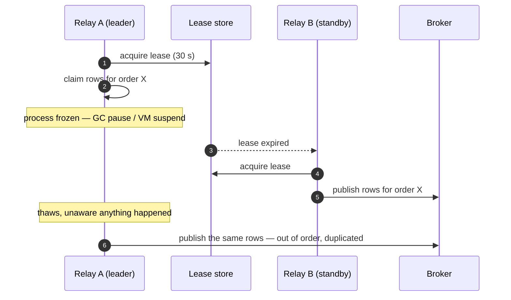

**Mitigation.**

- **Prefer `SKIP LOCKED` to leases.** The row lock lives inside the database and
  dies with the connection: a frozen relay's transaction is aborted server-side,
  and when it thaws its writes fail because its transaction no longer exists.
  This is the strongest argument for `SKIP LOCKED`, beyond concurrency — it makes
  the zombie case structurally impossible. PostgreSQL advisory locks share the
  property.
- If you must use a lease, **fence it**: carry a monotonically increasing
  generation number, and re-verify ownership *inside the same transaction* as the
  publish-marking — `UPDATE outbox SET status='published' WHERE id = :id AND
  :my_generation = (SELECT generation FROM relay_lease)`. A stale leader's writes
  are then rejected by the database rather than trusted. This is Kleppmann's
  fencing token (DDIA ch. 8), and a lease without one is not safe.
- Never rely on "the process would have noticed" — a frozen process notices
  nothing, by definition.

#### Concurrent duplicate delivery

**Mechanism.** Two consumer instances receive the same `event_id` at the same
moment — a rebalance mid-flight, or a redelivery while the first instance is
still working. Both attempt the inbox insert.

**Why it is already handled.** The primary key does the work: the second `INSERT`
blocks until the first transaction resolves, then either conflicts (skip) or
succeeds (process, because the first rolled back). Both outcomes are correct.

**Caveats worth knowing.**

- Under `SERIALIZABLE` isolation this surfaces as a serialization failure rather
  than a conflict. Classify it **transient** and retry the whole transaction —
  treating it as permanent dead-letters healthy messages.
- The blocked instance holds a connection for the duration of the first
  transaction. Another reason to keep handlers short.
- **Never "optimise" with a `SELECT` before the `INSERT`.** Check-then-act races:
  both instances see no row and both proceed. The atomic insert *is* the check.

### Consumer semantics

#### The missing prerequisite

**Mechanism.** `payment.captured` (keyed by payment id) and `order.placed` (keyed
by order id) land in different partitions, possibly different topics. No ordering
guarantee exists *between* keys, so the consumer can receive a capture for an
order it has never heard of.

**Mitigation, in order of preference.**

1. **Make events self-contained.** If the capture carries the order context the
   consumer needs, there is no prerequisite to miss. This is the strongest
   practical argument for event-carried state transfer ([§6](#how-much-state-to-carry)).
2. **Park and retry.** Treat "prerequisite absent" as a transient error: delayed
   redelivery, bounded attempts, then dead-letter. Usually sufficient, because
   the real-world gap is milliseconds.
3. **Reconsider the boundary.** If two aggregates genuinely require ordering
   between them, that is evidence they may be one consistency boundary.
4. **Do not call back to the producer to fill the gap.** It reintroduces the
   coupling you removed and returns state from a different point in time (see
   below).

#### Unknown event type

**Mechanism.** The producer deploys a new event type; an older consumer receives
it.

**The decision, which must be deliberate:**

| Policy | Correct when |
|---|---|
| **Skip and acknowledge** | The consumer subscribes to a shared topic carrying many types and only cares about some. The right default for shared topics. |
| **Dead-letter** | The consumer is expected to handle everything on its topic, so an unknown type signals a deployment-ordering mistake worth surfacing loudly. |

**Never** crash, and never retry forever. A consumer that dies on an unrecognised
type turns every producer deploy into a consumer outage — and because the
message is redelivered, into a crash loop.

Either way: log and count. **Alert on a rising unknown-type rate** — it is the
earliest available signal of a contract mismatch, usually arriving before anyone
notices missing data downstream.

#### Poison messages that crash the process

**Mechanism.** A payload that exhausts memory, blows the stack, or triggers a
native crash kills the process *before* any retry or dead-letter logic runs.
Restart, redelivery, same crash. The consumer group rebalances endlessly and lag
grows on **every** partition, not just the poisoned one.

This is worse than an ordinary poison message: your entire retry ladder
([§15](#the-retry-ladder)) is unreachable code.

**Mitigation.**

- **Bound payload size at produce time** ([§6](#size)). The cheapest possible
  prevention, applied at the only place with full control.
- **Defensive limits at parse time**: cap decompressed size, array lengths and
  nesting depth, and reject before allocating. Validate before you deserialise.
- **A crash-loop escape hatch.** Track delivery count out of band — the broker's
  delivery-count header where available, or a small counter keyed by `event_id`
  written *before* processing — and divert to the DLQ past a threshold. This is
  the one legitimate reason to write something before doing the work, and it is
  worth the exception because nothing else can break the loop.
- **Alert on consumer restart rate.** A crash loop otherwise presents as ordinary
  lag, and you will spend the first hour investigating the wrong thing.

#### Read-your-writes across the asynchronous gap

**Mechanism.** A consumer handles `order.placed`, then calls the order service for
details. Against the primary it may get state *newer* than its event (the order
has since been cancelled); against a read replica it may get state *older* — or
find nothing at all. Both produce results corresponding to no consistent point in
time.

**Mitigation.** Carry the state in the event. If a callback is unavoidable, pass
the aggregate version you expect and have the API return that version or fail,
rather than silently blending two points in time.

The user-facing corollary: the producer returns `201` before any consumer has
caught up, so an immediate read of a downstream projection may legitimately show
nothing. Design for it — optimistic rendering, polling, or an explicit
"processing" state — rather than assuming the gap is small enough to ignore. It
is small until the relay backs up.

### Lifecycle

#### Bootstrapping a new consumer

**Mechanism.** A new service needs history that predates it, and broker retention
does not reach back far enough.

**Mitigation.**

- **Snapshot plus catch-up.** Record the current offset *first*, then export
  current state from the producer, load it, then consume from the recorded
  offset. Duplicates across the overlap are absorbed by idempotency — which is
  precisely why the offset is taken before the export, not after. Taking it
  afterwards leaves a gap, and a gap is silent.
- **Replay from the producer's outbox archive**, if published rows were kept long
  enough. Republish with the original `event_id`s so existing consumers
  deduplicate while the new one processes.
- **Log compaction** (Kafka) retains the latest event per key indefinitely —
  excellent for state topics, useless for event history.

Decide this before the first consumer ships: it constrains retention policy for
everything that follows.

#### In-flight schema skew during deployment

**Mechanism.** Rows sit in the outbox in the old format while you deploy the new
one. The relay and consumers meet both formats at once.

**Mitigation.**

- The relay is unaffected **if it is a genuine dumb pipe** — it copies bytes and
  never parses the payload. Another dividend of the rule from [§7](#7-the-polling-publisher).
- Consumers must handle the old version until the backlog drains — which is at
  least the retention window, not just the length of the deploy.
- **The reader changes first.** Deploy consumers before producers when adding a
  type; retire producers before consumers when removing one.
- A backlog during a rolling restart is normal, since the relay pauses. Size
  alert thresholds so a routine deploy does not page anyone — an alert that fires
  on every deploy is an alert everyone learns to ignore.

#### Very large transactions

**Mechanism.** A bulk operation writes 50,000 outbox rows in one commit. Three
things follow: a long-running transaction that holds back vacuum, a WAL spike,
and — because all the rows become visible simultaneously — a sudden backlog that
delays every ordinary event queued behind it. Under CDC the same transaction
arrives as one enormous burst.

**Mitigation.**

- **Chunk the work** into many transactions, each atomic in itself.
- If the operation must be atomic, that is a hint it should be **one event
  describing the bulk change** rather than 50,000 individual ones. Emit a batch
  event carrying a reference to the affected set and let the consumer paginate.
- If neither is possible, give bulk events their own `aggregate_type` and relay
  shard so they cannot starve interactive traffic.
- Watch the interaction with head-of-line blocking: 50,000 rows for a *single*
  aggregate under strict ordering means a 50,000-message serial publish, during
  which that aggregate is frozen.

### The three that can actually lose data

Most edge cases above degrade into duplicates, delay or reprocessing — all of
which the pattern is built to absorb. Exactly three defeat the guarantee
outright, and they deserve separate treatment in your runbook:

| Edge case | Why the pattern cannot save you | The control |
|---|---|---|
| **Broker retention expires before consumption** | The outbox's responsibility ended at the broker ack | Alert on lag *relative to retention* |
| **Failover with asynchronous replication** | The commit itself was lost; there is nothing to relay | Synchronous replication, or a documented RPO |
| **PITR beyond the inbox retention window** | Deduplication memory is older than the restore | Rehearsed runbook; retention sized against RPO |

Everything else in this section is recoverable. These three are not, so decide
your position on each of them deliberately rather than discovering it.

## 21. Testing

The guarantees in the table above are claims about crash behavior. Tests that
never crash anything do not verify them.

### Unit tests

Fast and narrow: envelope construction, backoff arithmetic, error classification
(a size-limit error must be classified permanent, a timeout transient), topic and
key derivation from a row.

### Integration tests — real database, real broker

Run both in containers. These are the tests that verify the pattern.

| Test | Assertion |
|---|---|
| Atomic write | After `place_order`, the order row and the outbox row both exist. |
| Atomic rollback | Force a failure after the outbox insert; **neither** row exists. |
| Relay publishes | A pending row is published and marked, with `event_id`, key and headers intact. |
| Relay ordering | Two events for one aggregate arrive at the broker in `id` order. |
| Concurrent relays do not double-publish | Run two relays against 1,000 rows; the broker receives exactly 1,000 messages. |
| Transient failure | A rejecting broker leaves the row `pending` with `attempts` incremented and `available_at` in the future. |
| Permanent failure | An oversized message moves to `failed` immediately, without exhausting attempts. |
| Consumer idempotency | Deliver the same message twice; the side effect occurred exactly once, and both deliveries were acknowledged. |
| Consumer atomicity | Force a failure inside the handler; assert **no inbox row** and no partial state. |
| Consumer ordering | Two events for one key are processed in order. |
| Dead-lettering | A permanently failing message lands in the DLQ with its original payload and headers. |
| Replay | Republishing a DLQ message after a fix processes it once. |

### Fault injection — the tests that actually prove it

The crash window is untestable without simulating a crash. Make it injectable:

```
# in the relay, behind a test-only hook
publish(row)
if fault.enabled("crash_after_publish"):
    raise SimulatedCrash()      # exits before marking published
mark_published(row)
```

| Scenario | Assertion |
|---|---|
| Crash after publish, before mark | The message is published twice; the consumer's side effect happened once. |
| Broker down for N seconds | Requests keep succeeding; the backlog drains completely afterwards; nothing is lost. |
| Kill the consumer mid-transaction | No partial state; the message is redelivered and processed. |
| Kill the consumer between commit and ack | Redelivered, deduplicated, acknowledged, side effect still once. |
| Kill a relay holding a claim | Another relay picks the rows up within one poll interval. |
| Duplicate the entire published stream | The consumer's final state is identical. |

### The end-to-end invariant

The best single test asserts the property, not the mechanism:

> For any sequence of business operations, with faults injected at arbitrary
> points, once the system quiesces: **every committed order has exactly one
> effective downstream projection, and every downstream projection corresponds to
> a committed order.**

Run it with randomised operations and randomised fault injection. It catches
whole classes of bug that scenario tests miss, because it does not require you to
have imagined the interleaving in advance.

### Load

Verify the relay keeps up at your peak write rate and that the oldest-pending-age
metric stays inside its alert threshold under sustained load. Measure how long a
one-hour backlog takes to drain — that number is your recovery time after a
broker outage, and people will ask for it during an incident.

## 22. Anti-patterns

Each of these appears in real systems, usually written by someone who believed
they had implemented the pattern.

### Fatal — the pattern is broken

| Anti-pattern | Consequence |
|---|---|
| **Publishing to the broker inside the business transaction** | Order C from [§1](#1-the-dual-write-problem). A rollback cannot recall a published message. |
| **Publishing from an after-commit hook** | Order A with better syntax. The process can die before the hook runs. |
| **Marking published before the broker acknowledges** | Fire-and-forget loses messages that were never durably accepted, and the row is gone from the pending set forever. |
| **Deleting the outbox row before the acknowledgement** | Same loss, faster. |
| **Regenerating `event_id` on each publish attempt** | Consumer deduplication silently stops working. Every retry becomes a "new" event. |
| **A cursor-based relay (`WHERE id > :last_seen`)** | Skips rows that committed out of sequence order, permanently and silently ([§4](#the-visibility-gap--why-status-beats-a-cursor)). |
| **Marking the inbox row before doing the work** | A crash in between loses the work permanently; redelivery deduplicates it away. |
| **Deduplicating in Redis while the work commits in the database** | Two systems, no shared transaction. The original dual write, relocated. |
| **Auto-acknowledge / auto-commit offsets** | Acknowledges on delivery or a timer, not on success. Any processing failure loses the message. |
| **A Bloom filter as the deduplication store** | False positives mean "already processed" for a message that was not. Silent loss. |
| **No idempotency on the consumer at all** | The pattern's guarantee is at-least-once. Without consumer idempotency, duplicates are business bugs — double shipments, double charges. |

### Serious — it works until it doesn't

| Anti-pattern | Consequence |
|---|---|
| **No partition key on publish** | Ordering is lost in the broker regardless of relay care. |
| **Parallel processing within a partition** | Destroys the ordering the entire producing end preserved. |
| **Retrying permanent errors forever** | Livelock. Lag grows without bound; the key is blocked; it looks like an outage. |
| **Treating a broker outage as a per-message failure** | Burns `attempts` on thousands of healthy rows and dead-letters the whole backlog. |
| **A dead-letter queue with no alert** | A delete key with extra latency. |
| **No purge job** | The table and its indexes grow until the relay's query — and eventually the disk — degrades. |
| **Business logic in the relay** | Enrichment, lookups or re-rendering at publish time means the message was not determined at commit time. The relay is a dumb pipe. |
| **Ordering the relay by a timestamp column** | Clock skew and ties reorder events. Order by the sequence. |
| **Storing large blobs in the outbox** | A hot, heavily-vacuumed table becomes slow, and the broker rejects the message. Use a claim check. |
| **Unbounded in-process retry loops holding the transaction** | Locks held for the duration of a broker outage. |
| **Ignoring the inbox retention window during a replay** | Reprocesses everything older than the window. |
| **Consumer processing that exceeds the broker's lease** | Redelivery while still processing: concurrent duplicate work. |

### Conceptual — the design is off

| Anti-pattern | Consequence |
|---|---|
| **Using the outbox as an event store** | It is a transport buffer whose rows are deleted. It is not a source of truth and cannot be replayed from beyond retention. If you want an event log, use event sourcing or the broker's retention. |
| **Sharing one outbox table across services** | Shared database, shared deployment risk, shared schema. The coupling the architecture exists to remove. |
| **Publishing raw table diffs as domain events** | Your schema becomes your public API, and intent is unrecoverable ([§11](#direct-cdc-on-domain-tables--a-different-pattern)). |
| **Notification-only events everywhere** | Every consumer calls back to the producer: coupling, load, and the callback returns newer state than the event describes. |
| **Assuming broker deduplication gives exactly-once** | Kafka's idempotent producer covers one session; SQS FIFO covers five minutes. Neither covers a relay retry after an outage. |
| **Treating sequence gaps as lost events** | Rolled-back transactions consume sequence values. Gaps are normal. |
| **Adding the outbox where a single transaction would do** | If both writes are in one database, use one transaction. |

## 23. When not to use it

The pattern costs a table, a process, a purge job, monitoring, and an inbox in
every consumer. Some situations do not warrant it.

**Skip it when:**

- **Both writes are in the same database.** Use one transaction. There is no dual
  write to solve.
- **Loss is acceptable.** Metrics, telemetry, non-critical analytics, cache
  invalidation hints that a TTL would fix anyway. Publish directly and move on.
- **The message *is* the request.** A command sent to a queue with no local state
  change has nothing to be atomic with.
- **You are already event-sourced** — see below.

### The alternatives

| Alternative | How it works | When it wins | What it costs |
|---|---|---|---|
| **Event sourcing** | The event log *is* the source of truth; state is derived by folding it. There is no dual write because there is only one write. | Full audit history, temporal queries, replayable state | A far larger commitment: projections, snapshots, versioning, replay tooling, and a different way of thinking about all your data |
| **Direct CDC on domain tables** | Tail the log of the business tables themselves | Replication, analytics, data lakes, and getting data out of a system you cannot modify | Row-shaped events, schema coupling, no intent ([§11](#direct-cdc-on-domain-tables--a-different-pattern)) |
| **Listen to yourself** | Publish to the broker first; the service consumes its own event to persist its state | One write path; the broker is the source of truth | Loses read-your-own-writes: the caller gets a `202` and the state is not yet queryable. Broker downtime becomes write downtime. |
| **2PC / XA** | Distributed transaction across database and broker | Genuinely XA-capable resources, low volume, legacy estates | Coordinator failure modes, multiplied unavailability, and no support in modern brokers ([§2](#2-why-not-two-phase-commit)) |
| **Reconciliation job** | Periodically compare state against downstream and emit what is missing | A safety net alongside the outbox | Hours of latency; needs a way to distinguish "never sent" from "sent and ignored" — which is an outbox with extra steps |
| **Polling the domain table** (`WHERE updated_at > :cursor`) | Detect changed rows and publish | Nothing you cannot do better with an outbox | Misses deletes, misses intent, misses intermediate states, and inherits the cursor-visibility bug |

### Its relationship to sagas

A saga coordinates a business process across services through a sequence of local
transactions and compensating actions. Sagas depend on reliable messaging: a lost
step stalls the process, and a phantom step compensates something that never
happened.

The outbox is what makes that messaging reliable. Sagas and the outbox are not
alternatives — the outbox is the transport a saga is built on.

## 24. Implementation checklists

### Producing end

- [ ] Outbox table with `id`, `event_id`, `aggregate_type`, `aggregate_id`,
      `event_type`, `schema_version`, `payload`, `headers`, `occurred_at`, and
      relay bookkeeping columns.
- [ ] Partial index on pending rows, ordered by `(available_at, id)`.
- [ ] `event_id` unique, generated once at insert, never regenerated.
- [ ] The outbox insert is in the **same transaction** as the business write —
      verified by a rollback test, not by inspection.
- [ ] No network calls inside that transaction.
- [ ] No after-commit hook used as the delivery path.
- [ ] Payload serialised into its final published form at insert time.
- [ ] `traceparent` and `correlation_id` propagated into headers.
- [ ] Envelope follows CloudEvents (or a documented equivalent), with a version.
- [ ] Schema evolution rules written down; consumers are tolerant readers.
- [ ] Payload size bounded; a claim check for anything large.

### Relay

- [ ] Claims by **status**, never by a stored cursor.
- [ ] `FOR UPDATE SKIP LOCKED` (or an atomic claim plus a reaper with a lease
      longer than the worst-case publish).
- [ ] Ordered by `id`, never by a timestamp.
- [ ] Waits for the broker's durability acknowledgement before marking published.
- [ ] Broker configured for durability (`acks=all`, publisher confirms, durable
      queues, persistent delivery).
- [ ] Partition key set to `aggregate_id`.
- [ ] Transient and permanent errors classified differently.
- [ ] Exponential backoff with jitter via `available_at`.
- [ ] `max_attempts` then `failed`, with an alert.
- [ ] Idle backoff with jitter; optional `LISTEN/NOTIFY` as an optimisation only.
- [ ] Single active instance (advisory lock) or sharded by key hash — decided
      deliberately, not by accident.
- [ ] Runs as its own process with its own liveness signal reflecting progress.
- [ ] Graceful shutdown finishes the batch and releases the lock.

### Consuming end

- [ ] Every handler is idempotent — naturally, by unique constraint, or via the
      inbox.
- [ ] Inbox table keyed by `(consumer, event_id)`.
- [ ] Inbox insert and business work commit in **one transaction**.
- [ ] Acknowledge only after that commit.
- [ ] Auto-acknowledge and auto-offset-commit disabled.
- [ ] Processing time bounded well inside the broker's lease; heartbeats or
      extensions for long work.
- [ ] Sequential processing within a partition or key group.
- [ ] Version guards where reordering is possible.
- [ ] Transient and permanent errors classified differently.
- [ ] Retry ladder, then a dead letter carrying payload, headers, reason and
      attempt count.
- [ ] External side effects use the provider's idempotency key, or a
      consumer-side outbox.
- [ ] Unknown event types and unknown fields handled without crashing.

### Operations

- [ ] Alert on the age of the oldest pending row.
- [ ] Alert on `failed` outbox rows.
- [ ] Alert on DLQ depth greater than zero.
- [ ] Alert on consumer lag and on replication slot lag if using CDC.
- [ ] Purge jobs for `outbox` and `inbox`, running in bounded batches.
- [ ] Retention windows written down, with the inbox window exceeding the
      redelivery window.
- [ ] Autovacuum tuned for the outbox table; `fillfactor` lowered for in-page
      updates (HOT is not achievable with a status-predicated index).
- [ ] A documented backlog threshold and drain-time estimate.
- [ ] Dashboards for end-to-end latency and duplicate rate.
- [ ] Fault-injection tests in CI covering the crash window on both ends.

## 25. Glossary and further reading

### Glossary

**Aggregate** — a consistency boundary in the domain (an order, an account). The
unit that events are about and that ordering is guaranteed within.

**At-least-once** — every message is delivered one or more times. The delivery
guarantee this pattern provides.

**Backpressure** — the buildup that occurs when a downstream system cannot keep
up. Here, a growing outbox during a broker outage.

**CDC (change data capture)** — deriving a stream of change events by reading a
database's replication log.

**Claim check** — storing a large payload externally and putting a reference in
the message.

**Dead letter** — a message parked after exhausting retries, kept for diagnosis
and replay.

**Dual write** — writing to two systems that cannot commit atomically. The
problem this pattern exists to solve.

**Effectively-once** — at-least-once delivery plus idempotent processing, so that
effects occur once even though messages arrive more than once.

**Envelope** — the metadata wrapper around a message body (id, type, source,
time, trace context).

**Fencing token** — a monotonically increasing number carried by a lease holder
and re-checked at the point of writing, so a resumed zombie leader's writes are
rejected. A lease without one is not safe.

**Event-carried state transfer** — including the state consumers need in the
event, so they need not call back.

**Head-of-line blocking** — a stuck message preventing progress on everything
behind it. The price of strict ordering.

**Idempotent** — producing the same result whether applied once or many times.

**Log compaction** — a Kafka retention mode that keeps the latest message per key
indefinitely. Useful for state topics, useless for event history.

**Inbox** (idempotent receiver, processed-messages table) — the consumer-side
record of handled message ids, written transactionally with the work.

**Partition key** — the value the broker hashes to choose a partition. Set it to
the aggregate id to preserve per-entity ordering.

**Poison message** — a message that can never be processed successfully.

**Relay** (message relay, polling publisher) — the process that moves outbox rows
to the broker.

**Replication slot** — a PostgreSQL object guaranteeing WAL retention for a
logical replication consumer. Abandoned slots fill disks.

**RPO (recovery point objective)** — the amount of recent data an outage may
lose. For a service that publishes events it is a system-wide number, not a
database-local one ([§20](#20-edge-cases-and-how-to-handle-them)).

**`SKIP LOCKED`** — a SQL clause that skips rows locked by other transactions
instead of waiting, enabling safe concurrent queue consumers.

**Tolerant reader** — a consumer that ignores fields it does not recognise,
making additive producer changes safe.

**Transaction log tailing** — the CDC-based implementation of the relay.

**Two Generals problem** — the impossibility result behind exactly-once delivery.

**WAL (write-ahead log)** — the ordered log of committed changes a database
writes for durability and replication; the source CDC reads.

### Further reading

**The pattern itself**

- Chris Richardson, *microservices.io* — `Transactional Outbox`, `Polling
  Publisher`, and `Transaction Log Tailing`. The canonical formulation and the
  source of the terminology used throughout this document.
- Chris Richardson, *Microservices Patterns* (Manning, 2018), ch. 3 —
  transactional messaging in context.

**Foundations**

- Martin Kleppmann, *Designing Data-Intensive Applications* (O'Reilly, 2017) —
  ch. 7 (transactions), ch. 9 (2PC, consensus, in-doubt transactions), ch. 11
  (stream processing, CDC, exactly-once and idempotence). The rigorous treatment
  of every guarantee claimed here. **Chapter numbers are for the 1st edition**;
  the 2nd edition reorganises and renumbers them.
- Pat Helland, *Life Beyond Distributed Transactions: An Apostate's Opinion*
  (CIDR, 2007) — why at-scale systems abandon distributed transactions for
  at-least-once messaging plus idempotence.
- Gregor Hohpe and Bobby Woolf, *Enterprise Integration Patterns*
  (Addison-Wesley, 2003) — `Guaranteed Delivery`, `Idempotent Receiver`,
  `Dead Letter Channel`, `Claim Check`. The vocabulary predates microservices by
  fifteen years.

**Implementation**

- Debezium documentation — the `Outbox Event Router` transform, PostgreSQL and
  MySQL connectors, replication slot management.
- Apache Kafka documentation — delivery semantics, the idempotent producer,
  transactions and exactly-once within Kafka's boundary.
- CloudEvents 1.0 specification (CNCF) — the standard envelope and its Kafka,
  AMQP and HTTP bindings.
- PostgreSQL documentation — `SELECT ... FOR UPDATE SKIP LOCKED`, advisory locks,
  logical replication, `LISTEN`/`NOTIFY`.

**Related**

- Martin Fowler, *What do you mean by "Event-Driven"?* — distinguishes event
  notification from event-carried state transfer.
- Chris Richardson, *microservices.io* — `Saga` and `Event Sourcing`, for the
  patterns this one is usually deployed alongside.
